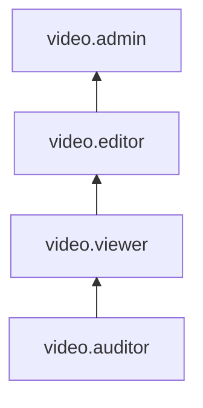

# Управление доступом в Yandex Cloud Video

В этом разделе вы узнаете:

* [на какие ресурсы можно назначить роль](#resources);
* [какие роли действуют в сервисе](#roles-list).

## Об управлении доступом {#about-access-control}

Доступ к сервису Cloud Video регулируется путем назначения прав в [организации](../../organization/concepts/organization.md). Управление организациями осуществляется с помощью сервиса [Yandex Identity Hub](../../organization/index.md).

Список операций, доступных пользователю Cloud Video, определяется его ролью. Роли можно назначить аккаунту на Яндексе, [федеративным](../../iam/concepts/users/accounts.md#saml-federation) или [локальным](../../iam/concepts/users/accounts.md#local) пользователям, [группе пользователей](../../organization/operations/manage-groups.md), [системной группе](../../iam/concepts/access-control/system-group.md) или [публичной группе](../../iam/concepts/access-control/public-group.md). Подробнее об управлении доступом в Yandex Cloud см. раздел [Как устроено управление доступом в Yandex Cloud](../../iam/concepts/access-control/index.md).

Назначать роли на ресурс могут пользователи, у которых на этот ресурс есть роль `video.admin` или одна из следующих ролей:

* `admin`;
* `resource-manager.admin`;
* `organization-manager.admin`;
* `resource-manager.clouds.owner`;
* `organization-manager.organizations.owner`.

## На какие ресурсы можно назначить роль {#resources}

Вы можете назначить роль на [канал](../concepts/index.md#channels) в [интерфейсе](https://video.yandex.cloud/) Cloud Video или через [API](../api-ref/authentication.md).

## Добавление пользователя в Cloud Video {#add-user}

Добавить пользователя в Cloud Video можно следующими способами:
* Отправить приглашение из [интерфейса](https://video.yandex.cloud/) Cloud Video, указав электронную почту, с которой пользователь зарегистрирован в организации.
* [Назначить](../../organization/security/index.md) пользователю права доступа через интерфейс Yandex Identity Hub.

## Какие роли действуют в сервисе {#roles-list}

На диаграмме показано, какие роли есть в сервисе и как они наследуют разрешения друг друга. Например, в `editor` входят все разрешения `viewer`. После диаграммы дано описание каждой роли.

### Сервисные роли {#service-roles}

#### video.auditor {#video-auditor}

Роль `video.auditor` позволяет просматривать информацию о ресурсах сервиса Cloud Video или отдельного [канала](../concepts/index.md#channels), их настройках и назначенных [правах доступа](../../iam/concepts/access-control/index.md).

#### video.viewer {#video-viewer}

Роль `video.viewer` позволяет просматривать информацию о ресурсах сервиса Cloud Video или отдельного канала, их настройках и назначенных правах доступа.

Пользователи с этой ролью могут:
* просматривать информацию о ресурсах сервиса Cloud Video и их настройках;
* скачивать исходные файлы [видео](../concepts/videos.md) и их [субтитров](../concepts/videos.md#subtitles), а также изображения обложек видео;
* просматривать информацию о назначенных [правах доступа](../../iam/concepts/access-control/index.md) к [каналам](../concepts/index.md#channels) Cloud Video.

Включает разрешения, предоставляемые ролью `video.auditor`.

#### video.editor {#video-editor}

Роль `video.editor` позволяет управлять ресурсами сервиса Cloud Video или отдельного канала, а также выполнять трансляцию видеопотока.

Пользователи с этой ролью могут:
* просматривать информацию о ресурсах сервиса Cloud Video и их настройках, а также создавать, изменять и удалять такие ресурсы;
* выполнять [трансляцию](../concepts/streams.md#streams) видеопотока Cloud Video в прямом эфире;
* скачивать исходные файлы [видео](../concepts/videos.md) и их [субтитров](../concepts/videos.md#subtitles), а также изображения обложек видео;
* использовать возможности ИИ, такие как [суммаризация](../concepts/videos.md#summarization) и [нейроперевод](../concepts/videos.md#stranslation) видео;
* просматривать информацию о назначенных [правах доступа](../../iam/concepts/access-control/index.md) к [каналам](../concepts/index.md#channels) Cloud Video.

Включает разрешения, предоставляемые ролью `video.viewer`.

#### video.admin {#video-admin}

Роль `video.admin` позволяет управлять ресурсами сервиса Cloud Video или отдельного канала, назначать права доступа ко всем ресурсам или ресурсам канала.

Пользователи с этой ролью могут:
* просматривать информацию о назначенных [правах доступа](../../iam/concepts/access-control/index.md) к [каналам](../concepts/index.md#channels) Cloud Video и изменять такие права доступа;
* просматривать информацию о ресурсах сервиса Cloud Video и их настройках, а также создавать, изменять и удалять такие ресурсы;
* выполнять [трансляцию](../concepts/streams.md#streams) видеопотока Cloud Video в прямом эфире;
* скачивать исходные файлы [видео](../concepts/videos.md) и их [субтитров](../concepts/videos.md#subtitles), а также изображения обложек видео;
* использовать возможности ИИ, такие как [суммаризация](../concepts/videos.md#summarization) и [нейроперевод](../concepts/videos.md#stranslation) видео.

Включает разрешения, предоставляемые ролью `video.editor`.

### Примитивные роли {#primitive-roles}

Примитивные роли позволяют пользователям совершать действия во [всех сервисах](../../overview/concepts/services.md) Yandex Cloud.

#### auditor {#auditor}

Роль `auditor` предоставляет разрешения на чтение конфигурации и метаданных любых ресурсов Yandex Cloud без возможности доступа к данным.

Например, пользователи с этой ролью могут:
* просматривать информацию о [ресурсе](../../resource-manager/concepts/resources-hierarchy.md);
* просматривать метаданные ресурса;
* просматривать список операций с ресурсом.

Роль `auditor` — наиболее безопасная роль, исключающая доступ к данным [сервисов](../../overview/concepts/services.md). Роль подходит для пользователей, которым необходим минимальный уровень доступа к ресурсам Yandex Cloud.

#### viewer {#viewer}

Роль `viewer` предоставляет разрешения на чтение информации о любых [ресурсах](../../resource-manager/concepts/resources-hierarchy.md) Yandex Cloud.

Включает разрешения, предоставляемые ролью `auditor`.

В отличие от роли `auditor`, роль `viewer` предоставляет доступ к данным [сервисов](../../overview/concepts/services.md) в режиме чтения.

#### editor {#editor}

Роль `editor` предоставляет разрешения на управление любыми [ресурсами](../../resource-manager/concepts/resources-hierarchy.md) Yandex Cloud, кроме назначения ролей другим пользователям, передачи прав владения [организацией](../../organization/concepts/organization.md) и ее удаления, а также удаления [ключей шифрования](../../kms/concepts/index.md) Key Management Service.

Например, пользователи с этой ролью могут создавать, изменять и удалять ресурсы.

Включает разрешения, предоставляемые ролью `viewer`.

#### admin {#admin}

Роль `admin` позволяет назначать любые роли, кроме `resource-manager.clouds.owner` и `organization-manager.organizations.owner`, а также предоставляет разрешения на управление любыми [ресурсами](../../resource-manager/concepts/resources-hierarchy.md) Yandex Cloud, кроме передачи прав владения [организацией](../../organization/concepts/organization.md) и ее удаления.

Прежде чем назначить роль `admin` на организацию, [облако](../../resource-manager/concepts/resources-hierarchy.md#cloud) или [платежный аккаунт](../../billing/concepts/billing-account.md), ознакомьтесь с информацией о защите [привилегированных аккаунтов](../../security/standard/all.md#privileged-users).

Включает разрешения, предоставляемые ролью `editor`.

Вместо примитивных ролей мы рекомендуем использовать роли сервисов. Такой подход позволит более гранулярно управлять доступом и обеспечить соблюдение [принципа минимальных привилегий](../../security/standard/all.md#min-privileges).

Подробнее о примитивных ролях см. в [справочнике ролей Yandex Cloud](../../iam/roles-reference.md#primitive-roles).