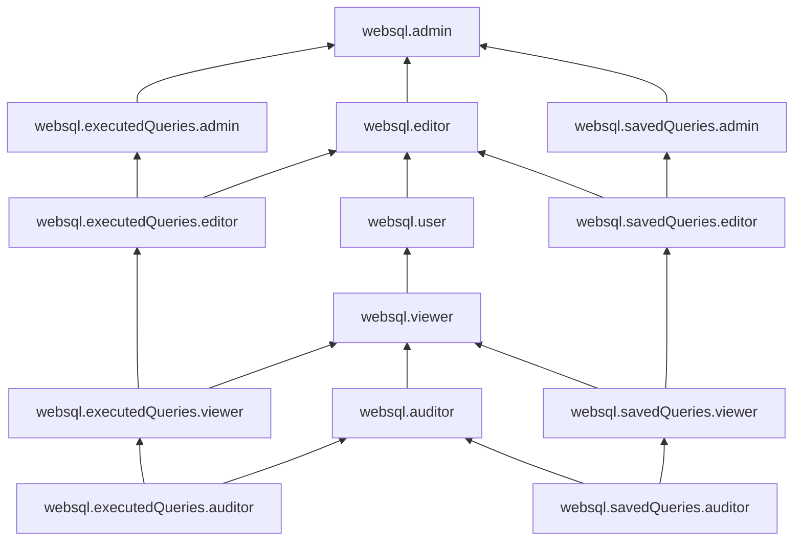

# Управление доступом в {{ websql-name }}

В этом разделе вы узнаете:

* [на какие ресурсы можно назначить роль](#resources);
* [какие роли действуют в сервисе](#roles-list);
* [какие роли необходимы](#required-roles) для того или иного действия.

## Об управлении доступом {#about-access-control}

Все операции в {{ yandex-cloud }} проверяются в сервисе [{{ iam-full-name }}](../../iam/index.md). Если у субъекта нет необходимых разрешений, сервис вернет ошибку.

Чтобы выдать разрешения к ресурсу, [назначьте роли](../../iam/operations/roles/grant.md) на этот ресурс субъекту, который будет выполнять операции. Роли можно назначить [аккаунту на Яндексе](../../iam/concepts/users/accounts.md#passport), [сервисному аккаунту](../../iam/concepts/users/service-accounts.md), [локальному пользователю](../../iam/concepts/users/accounts.md#local), [федеративному пользователю](../../iam/concepts/federations.md), [группе пользователей](../../organization/operations/manage-groups.md), [системной группе](../../iam/concepts/access-control/system-group.md) или [публичной группе](../../iam/concepts/access-control/public-group.md). Подробнее читайте в разделе [{#T}](../../iam/concepts/access-control/index.md).

Назначать роли на ресурс могут пользователи, у которых на этот ресурс есть роль `websql.admin` или одна из следующих ролей:

* `admin`;
* `resource-manager.admin`;
* `organization-manager.admin`;
* `resource-manager.clouds.owner`;
* `organization-manager.organizations.owner`.

## На какие ресурсы можно назначить роль {#resources}

Роль можно назначить на [организацию](../../organization/concepts/organization.md), [облако](../../resource-manager/concepts/resources-hierarchy.md#cloud) и [каталог](../../resource-manager/concepts/resources-hierarchy.md#folder). Роли, назначенные на организацию, облако или каталог, действуют и на вложенные ресурсы.

Кроме того, в [интерфейсе {{ websql-name }}]({{ websql-link }}) роли можно назначать на опубликованные [сохраненные запросы](../concepts/index.md#saved-queries) и [запросы из истории](../concepts/index.md#query-log).

## Какие роли действуют в сервисе {#roles-list}

Для управления правами доступа к запросам вы можете использовать роли сервиса {{ websql-full-name }} (_сервисные роли_) и роли {{ yandex-cloud }} (_примитивные роли_).

### Сервисные роли {#service-roles}

Ниже перечислены все роли, которые учитываются при проверке прав доступа в сервисе {{ websql-name }}.

#### websql.executedQueries.auditor {#websql-executedQueries-auditor}

Роль `websql.executedQueries.auditor` позволяет просматривать метаданные опубликованного запроса из истории и информацию о назначенных [правах доступа](../../iam/concepts/access-control/index.md) к нему.

#### websql.savedQueries.auditor {#websql-savedQueries-auditor}

Роль `websql.savedQueries.auditor` позволяет просматривать метаданные опубликованного сохраненного запроса и информацию о назначенных [правах доступа](../../iam/concepts/access-control/index.md) к нему.

#### websql.executedQueries.viewer {#websql-executedQueries-viewer}

Роль `websql.executedQueries.viewer` позволяет просматривать информацию об опубликованном запросе из истории и назначенных [правах доступа](../../iam/concepts/access-control/index.md) к нему.

Включает разрешения, предоставляемые  ролью `websql.executedQueries.auditor`.

Роль назначается на опубликованный запрос из истории.

#### websql.savedQueries.viewer {#websql-savedQueries-viewer}

Роль `websql.savedQueries.viewer` позволяет просматривать информацию об опубликованном сохраненном запросе и назначенных [правах доступа](../../iam/concepts/access-control/index.md) к нему.

Включает разрешения, предоставляемые  ролью `websql.savedQueries.auditor`.

Роль назначается на опубликованный сохраненный запрос.

#### websql.executedQueries.editor {#websql-executedQueries-editor}

Роль `websql.executedQueries.editor` позволяет просматривать информацию об опубликованном запросе из истории и удалять его.

Пользователи с этой ролью могут:
* просматривать информацию об опубликованном запросе из истории и удалять его;
* просматривать информацию о назначенных [правах доступа](../../iam/concepts/access-control/index.md) к опубликованному запросу из истории.

Включает разрешения, предоставляемые  ролью `websql.executedQueries.viewer`.

Роль назначается на опубликованный запрос из истории.

#### websql.savedQueries.editor {#websql-savedQueries-editor}

Роль `websql.savedQueries.editor` позволяет изменять и удалять опубликованный сохраненный запрос. 

Пользователи с этой ролью могут:
* просматривать информацию об опубликованном сохраненном запросе, а также изменять и удалять его;
* просматривать информацию о назначенных [правах доступа](../../iam/concepts/access-control/index.md) к опубликованному сохраненному запросу.

Включает разрешения, предоставляемые ролью `websql.savedQueries.viewer`.

Роль назначается на опубликованный сохраненный запрос.

#### websql.executedQueries.admin {#websql-executedQueries-admin}

Роль `websql.executedQueries.admin` позволяет управлять опубликованным запросом из истории и доступом к нему.

Пользователи с этой ролью могут:
* просматривать информацию о назначенных [правах доступа](../../iam/concepts/access-control/index.md) к опубликованному запросу из истории и изменять такие права доступа;
* просматривать информацию об опубликованном запросе из истории и удалять его.

Включает разрешения, предоставляемые  ролью `websql.executedQueries.editor`.

Роль назначается на опубликованный запрос из истории.

#### websql.savedQueries.admin {#websql-savedQueries-admin}

Роль `websql.savedQueries.admin` позволяет управлять опубликованным сохраненным запросом и доступом к нему.

Пользователи с этой ролью могут:
* просматривать информацию о назначенных [правах доступа](../../iam/concepts/access-control/index.md) к опубликованному сохраненному запросу и изменять такие права доступа;
* просматривать информацию об опубликованном сохраненном запросе, а также изменять и удалять его.

Включает разрешения, предоставляемые  ролью `websql.savedQueries.editor`.

Роль назначается на опубликованный сохраненный запрос.

#### websql.auditor {#websql-auditor}

Роль `websql.auditor` позволяет просматривать метаданные всех опубликованных запросов в сервисе {{ websql-name }} и информацию о назначенных [правах доступа](../../iam/concepts/access-control/index.md) к ним.

Включает разрешения, предоставляемые  ролями `websql.savedQueries.auditor` и `websql.executedQueries.auditor`.

#### websql.viewer {#websql-viewer}

Роль `websql.viewer` позволяет просматривать информацию обо всех опубликованных запросах в сервисе {{ websql-name }} и назначенных правах доступа к ним.

Пользователи с этой ролью могут:
* просматривать информацию об опубликованных сохраненных запросах и назначенных [правах доступа](../../iam/concepts/access-control/index.md) к ним;
* просматривать информацию об опубликованных запросах из истории и назначенных правах доступа к ним.

Включает разрешения, предоставляемые  ролями `websql.savedQueries.viewer` и `websql.executedQueries.viewer`.

#### websql.user {#websql-user}

Роль `websql.user` позволяет просматривать информацию об опубликованных запросах в сервисе {{ websql-name }}, а также создавать, изменять и удалять приватные запросы.

Пользователи с этой ролью могут:
* просматривать информацию об опубликованных сохраненных запросах и назначенных [правах доступа](../../iam/concepts/access-control/index.md) к ним;
* приватно сохранять запросы, а также изменять и удалять приватные сохраненные запросы;
* просматривать информацию об опубликованных запросах из истории и назначенных правах доступа к ним;
* сохранять исполненные запросы в приватную историю и удалять такие запросы из истории.

Включает разрешения, предоставляемые  ролью `websql.viewer`.

#### websql.editor {#websql-editor}

Роль `websql.editor` позволяет управлять опубликованными и приватными запросами в сервисе {{ websql-name }}.

Пользователи с этой ролью могут:
* просматривать информацию об опубликованных сохраненных запросах и назначенных [правах доступа](../../iam/concepts/access-control/index.md) к ним, а также изменять и удалять опубликованные сохраненные запросы;
* приватно сохранять запросы, а также изменять, удалять и публиковать приватные сохраненные запросы;
* просматривать информацию об опубликованных запросах из истории и назначенных правах доступа к ним, а также удалять опубликованные запросы из истории;
* сохранять исполненные запросы в приватную историю, а также публиковать приватные запросы из истории и удалять их.

Включает разрешения, предоставляемые  ролями `websql.user`, `websql.savedQueries.editor` и `websql.executedQueries.editor`.

#### websql.admin {#websql-admin}

Роль `websql.admin` позволяет управлять приватными запросами и публиковать их, а также управлять опубликованными запросами и доступом к ним.

Пользователи с этой ролью могут:
* просматривать информацию о назначенных [правах доступа](../../iam/concepts/access-control/index.md) к опубликованным сохраненным запросам и изменять такие права доступа;
* просматривать информацию об опубликованных сохраненных запросах, а также изменять и удалять их;
* приватно сохранять запросы, а также изменять, удалять и публиковать приватные сохраненные запросы;
* просматривать информацию о назначенных правах доступа к опубликованным запросам из истории и изменять такие права доступа;
* просматривать информацию об опубликованных запросах из истории и удалять их;
* сохранять исполненные запросы в приватную историю, а также публиковать приватные запросы из истории и удалять их.

Включает разрешения, предоставляемые  ролями `websql.editor`, `websql.savedQueries.admin` и `websql.executedQueries.admin`.

### Примитивные роли {#primitive-roles}

Примитивные роли позволяют пользователям совершать действия во [всех сервисах](../../overview/concepts/services.md) {{ yandex-cloud }}.

#### {{ roles-auditor }} {#auditor}

Роль `auditor` предоставляет разрешения на чтение конфигурации и метаданных любых ресурсов Yandex Cloud без возможности доступа к данным.

Например, пользователи с этой ролью могут:
* просматривать информацию о [ресурсе]({{ link-docs }}/resource-manager/concepts/resources-hierarchy);
* просматривать метаданные ресурса;
* просматривать список операций с ресурсом.

Роль `auditor` — наиболее безопасная роль, исключающая доступ к данным [сервисов]({{ link-docs }}/overview/concepts/services). Роль подходит для пользователей, которым необходим минимальный уровень доступа к ресурсам Yandex Cloud.

#### {{ roles-viewer }} {#viewer}

Роль `viewer` предоставляет разрешения на чтение информации о любых [ресурсах]({{ link-docs }}/resource-manager/concepts/resources-hierarchy) Yandex Cloud.

Включает разрешения, предоставляемые ролью `auditor`.

В отличие от роли `auditor`, роль `viewer` предоставляет доступ к данным [сервисов]({{ link-docs }}/overview/concepts/services) в режиме чтения.

#### {{ roles-editor }} {#editor}

Роль `editor` предоставляет разрешения на управление любыми [ресурсами]({{ link-docs }}/resource-manager/concepts/resources-hierarchy) Yandex Cloud, кроме назначения ролей другим пользователям, передачи прав владения [организацией]({{ link-docs }}/organization/concepts/organization) и ее удаления, а также удаления [ключей шифрования]({{ link-docs }}/kms/concepts/) Key Management Service.

Например, пользователи с этой ролью могут создавать, изменять и удалять ресурсы.

Включает разрешения, предоставляемые ролью `viewer`.

#### {{ roles-admin }} {#admin}

Роль `admin` позволяет назначать любые роли, кроме `resource-manager.clouds.owner` и `organization-manager.organizations.owner`, а также предоставляет разрешения на управление любыми [ресурсами]({{ link-docs }}/resource-manager/concepts/resources-hierarchy) Yandex Cloud, кроме передачи прав владения [организацией]({{ link-docs }}/organization/concepts/organization) и ее удаления.

Прежде чем назначить роль `admin` на организацию, [облако]({{ link-docs }}/resource-manager/concepts/resources-hierarchy#cloud) или [платежный аккаунт]({{ link-docs }}/billing/concepts/billing-account), ознакомьтесь с информацией о защите [привилегированных аккаунтов]({{ link-docs }}/security/standard/all#privileged-users).

Включает разрешения, предоставляемые ролью `editor`.

Вместо примитивных ролей мы рекомендуем использовать роли сервисов. Такой подход позволит более гранулярно управлять доступом и обеспечить соблюдение [принципа минимальных привилегий](../../security/standard/all.md#min-privileges).

Подробнее о примитивных ролях см. в [справочнике ролей {{ yandex-cloud }}](../../iam/roles-reference.md#primitive-roles).

## Какие роли мне необходимы {#required-roles}

В таблице ниже перечислено, какие роли нужны для выполнения указанного действия. Вы всегда можете назначить роль, которая дает более широкие разрешения, нежели указанная. Например, назначить `editor` вместо `viewer`. Или если требуется доступ к нескольким типам кластеров управляемых баз данных в одном каталоге, можно назначить роль `mdb.auditor` в этом каталоге, но имейте в виду, что пользователь получит избыточные [разрешения](../../iam/roles-reference.md#mdb-auditor).

Действие | Необходимые роли
----- | -----
**Просмотр запросов** |
Просмотр информации о подключениях | `{{ roles-connection-manager-viewer }}` на организацию, облако, каталог или подключение
Просмотр информации о подключениях {{ PG }} | `{{ roles.mpg.viewer }}` на организацию, облако или каталог
Просмотр информации о подключениях {{ MY }} | `{{ roles.mmy.viewer }}` на организацию, облако или каталог
Просмотр информации о подключениях {{ CH }} | `{{ roles.mch.viewer }}` на организацию, облако или каталог
Просмотр информации о подключениях {{ VLK }} | `{{ roles.mrd.viewer }}` на организацию, облако или каталог
Просмотр информации о подключениях {{ SD }} | `{{ roles.mmg.viewer }}` на организацию, облако или каталог
Просмотр информации о подключениях {{ GP }} | `{{ roles.mgp.viewer }}` на организацию, облако или каталог
Просмотр информации о подключениях [{{ mtr-full-name }}](../../managed-trino/concepts/index.md) (сервис находится на стадии [Preview](../../overview/concepts/launch-stages.md)) | `managed-trino.viewer` на организацию, облако или каталог
Просмотр метаданных опубликованных запросов | `websql.auditor` на организацию, облако или каталог
Просмотр опубликованных запросов | `websql.viewer` на организацию, облако или каталог
**Просмотр и выполнение запросов** |
Использование подключения к БД | `{{ roles-connection-manager-user }}` на организацию, облако, каталог или подключение
Просмотр информации о подключениях {{ PG }} | `{{ roles.mpg.viewer }}` на организацию, облако или каталог
Просмотр информации о подключениях {{ MY }} | `{{ roles.mmy.viewer }}` на организацию, облако или каталог
Просмотр информации о подключениях {{ CH }} | `{{ roles.mch.viewer }}` на организацию, облако или каталог
Просмотр информации о подключениях {{ VLK }} | `{{ roles.mrd.viewer }}` на организацию, облако или каталог
Просмотр информации о подключениях {{ SD }} | `{{ roles.mmg.viewer }}` на организацию, облако или каталог
Просмотр информации о подключениях {{ GP }} | `{{ roles.mgp.viewer }}` на организацию, облако или каталог
Просмотр информации о подключениях [{{ mtr-full-name }}](../../managed-trino/concepts/index.md) (сервис находится на стадии [Preview](../../overview/concepts/launch-stages.md)) | `managed-trino.viewer` на организацию, облако или каталог
Выполнение запросов | `websql.user` на организацию, облако или каталог
Выполнение запросов [{{ mtr-full-name }}](../../managed-trino/concepts/index.md) (сервис находится на стадии [Preview](../../overview/concepts/launch-stages.md)) | `managed-trino.user` на организацию, облако или каталог
**Просмотр, выполнение и публикация запросов** |
Использование подключения к БД | `{{ roles-connection-manager-user }}` на организацию, облако, каталог или подключение
Просмотр информации о подключениях {{ PG }} | `{{ roles.mpg.viewer }}` на организацию, облако или каталог
Просмотр информации о подключениях {{ MY }} | `{{ roles.mmy.viewer }}` на организацию, облако или каталог
Просмотр информации о подключениях {{ CH }} | `{{ roles.mch.viewer }}` на организацию, облако или каталог
Просмотр информации о подключениях {{ VLK }} | `{{ roles.mrd.viewer }}` на организацию, облако или каталог
Просмотр информации о подключениях {{ SD }} | `{{ roles.mmg.viewer }}` на организацию, облако или каталог
Просмотр информации о подключениях {{ GP }} | `{{ roles.mgp.viewer }}` на организацию, облако или каталог
Просмотр информации о подключениях [{{ mtr-full-name }}](../../managed-trino/concepts/index.md) (сервис находится на стадии [Preview](../../overview/concepts/launch-stages.md)) | `managed-trino.viewer` на организацию, облако или каталог
Выполнение, публикация и редактирование запросов | `websql.editor` на организацию, облако или каталог
Выполнение запросов [{{ mtr-full-name }}](../../managed-trino/concepts/index.md) (сервис находится на стадии [Preview](../../overview/concepts/launch-stages.md)) | `managed-trino.user` на организацию, облако или каталог
**Управление запросами** |
Использование подключения к БД | `{{ roles-connection-manager-user }}` на организацию, облако, каталог или подключение
Просмотр информации о подключениях {{ PG }} | `{{ roles.mpg.viewer }}` на организацию, облако или каталог
Просмотр информации о подключениях {{ MY }} | `{{ roles.mmy.viewer }}` на организацию, облако или каталог
Просмотр информации о подключениях {{ CH }} | `{{ roles.mch.viewer }}` на организацию, облако или каталог
Просмотр информации о подключениях {{ VLK }} | `{{ roles.mrd.viewer }}` на организацию, облако или каталог
Просмотр информации о подключениях {{ SD }} | `{{ roles.mmg.viewer }}` на организацию, облако или каталог
Просмотр информации о подключениях {{ GP }} | `{{ roles.mgp.viewer }}` на организацию, облако или каталог
Просмотр информации о подключениях [{{ mtr-full-name }}](../../managed-trino/concepts/index.md) (сервис находится на стадии [Preview](../../overview/concepts/launch-stages.md)) | `managed-trino.viewer` на организацию, облако или каталог
Выполнение, публикация, редактирование запросов и управление правами доступа к ним | `websql.admin` на организацию, облако или каталог
Выполнение запросов [{{ mtr-full-name }}](../../managed-trino/concepts/index.md) (сервис находится на стадии [Preview](../../overview/concepts/launch-stages.md)) | `managed-trino.user` на организацию, облако или каталог

## Что дальше {#whats-next}

* [Как назначить роль](../../iam/operations/roles/grant.md).
* [Как отозвать роль](../../iam/operations/roles/revoke.md).
* [Подробнее об управлении доступом в {{ yandex-cloud }}](../../iam/concepts/access-control/index.md).
* [Подробнее о наследовании ролей](../../resource-manager/concepts/resources-hierarchy.md#access-rights-inheritance).