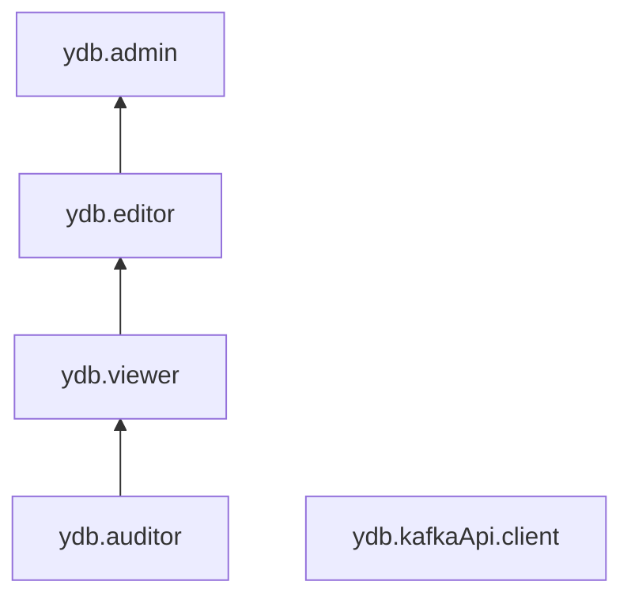

# Управление доступом в {{ ydb-name }}

Пользователь {{ yandex-cloud }} может выполнять только те операции над ресурсами, которые разрешены назначенными ему [ролями](../../iam/concepts/access-control/roles.md). Пока у пользователя нет никаких ролей, почти все операции ему запрещены.

Чтобы разрешить доступ к ресурсам сервиса {{ ydb-short-name }} (базы данных и их пользователи), назначьте аккаунту на Яндексе, [сервисному аккаунту](../../iam/concepts/users/service-accounts.md), [федеративным](../../iam/concepts/users/accounts.md#saml-federation) или [локальным](../../iam/concepts/users/accounts.md#local) пользователям, [группе пользователей](../../organization/operations/manage-groups.md), [системной группе](../../iam/concepts/access-control/system-group.md) или [публичной группе](../../iam/concepts/access-control/public-group.md) нужные роли из приведенного ниже списка. Роль может быть назначена на родительский ресурс (каталог или облако), роли которого наследуются вложенными ресурсами.

Подробнее о наследовании ролей читайте в разделе [{#T}](../../resource-manager/concepts/resources-hierarchy.md#access-rights-inheritance) документации сервиса {{ resmgr-full-name }}.

Кроме того можно выдать роль на доступ к конкретной базе данных. Это позволит пользователю без каких-либо ролей в каталоге, где размещена база, получить доступ к самой базе данных в соответствии с выданной ролью.

Назначать роли на ресурс могут пользователи, у которых на этот ресурс есть роль `ydb.admin` или одна из следующих ролей:

* `admin`;
* `resource-manager.admin`;
* `organization-manager.admin`;
* `resource-manager.clouds.owner`;
* `organization-manager.organizations.owner`.

## Назначение ролей {#grant-roles}

Чтобы назначить пользователю роль:

1. При необходимости [добавьте](../../organization/operations/add-account.md) нужного пользователя.
1. В [консоли управления]({{ link-console-main }}) слева [выберите](../../resource-manager/operations/cloud/switch-cloud.md) облако.
1. Перейдите на вкладку **{{ ui-key.yacloud.common.resource-acl.label_access-bindings }}**.
1. Нажмите кнопку **{{ ui-key.yacloud.common.resource-acl.button_configure-access }}**.
1. В открывшемся окне выберите раздел **{{ ui-key.yacloud_components.acl.label.user-accounts }}**.
1. Выберите пользователя из списка или воспользуйтесь поиском.
1. Нажмите кнопку  **{{ ui-key.yacloud_components.acl.button.add-role }}** и выберите роль в облаке.
1. Нажмите кнопку **{{ ui-key.yacloud.common.save }}**.

## На какие ресурсы можно назначить роль {#resources}

Роль можно назначить на [организацию](../../organization/concepts/organization.md), [облако](../../resource-manager/concepts/resources-hierarchy.md#cloud) и [каталог](../../resource-manager/concepts/resources-hierarchy.md#folder). Роли, назначенные на организацию, облако или каталог, действуют и на вложенные ресурсы.

Вы также можете назначать роли на отдельные ресурсы сервиса:



- Консоль управления {#console}

  Через [консоль управления]({{ link-console-main }}) вы можете назначить роли на базу данных YDB.

- CLI {#cli}

  Через [{{ yandex-cloud }} CLI](../../cli/cli-ref/ydb/cli-ref/index.md) вы можете назначить роли на следующие ресурсы:

  * база данных YDB;
  * резервная копия базы данных YDB.

- {{ TF }} {#tf}

  Через [{{ TF }}]({{ tf-provider-resources-link }}/ydb_database_iam_binding) вы можете назначить роли на базу данных YDB.

- API {#api}

  Через [API {{ yandex-cloud }}](../api-ref/authentication.md) вы можете назначить роли на следующие ресурсы:

  * база данных YDB;
  * резервная копия базы данных YDB.



## Какие роли действуют в сервисе {#roles-list}

Ниже перечислены все роли, которые учитываются при проверке прав доступа в сервисе {{ ydb-name }}.

### Сервисные роли {#service-roles}

#### ydb.auditor {#ydb-auditor}

Роль `ydb.auditor` позволяет устанавливать соединения c базами данных, просматривать информацию о БД и назначенных правах доступа к ним, а также о схемных объектах и резервных копиях БД.

Пользователи с этой ролью могут:
* устанавливать соединения c [базами данных](../concepts/resources.md#database);
* просматривать список баз данных и информацию о них, а также о назначенных [правах доступа](../../iam/concepts/access-control/index.md) к базам данных;
* просматривать информацию о резервных копиях баз данных и назначенных правах доступа к резервным копиям;
* просматривать список схемных объектов БД (таблиц, индексов и каталогов) и информацию о них;
* просматривать информацию о [квотах](../concepts/limits.md#ydb-quotas) сервиса {{ ydb-name }};
* просматривать информацию об [облаке](../../resource-manager/concepts/resources-hierarchy.md#cloud) и [каталоге](../../resource-manager/concepts/resources-hierarchy.md#folder).

#### ydb.viewer {#ydb-viewer}

Роль `ydb.viewer` позволяет устанавливать соединения c БД и выполнять запросы на чтение данных, просматривать информацию о БД и назначенных правах доступа к ним, а также о схемных объектах и резервных копиях БД.

Пользователи с этой ролью могут:
* устанавливать соединения c [базами данных](../concepts/resources.md#database) и выполнять запросы на чтение данных;
* просматривать список баз данных и информацию о них, а также о назначенных [правах доступа](../../iam/concepts/access-control/index.md) к базам данных;
* просматривать информацию о резервных копиях баз данных и назначенных правах доступа к резервным копиям;
* просматривать список схемных объектов БД (таблиц, индексов и каталогов) и информацию о них;
* просматривать информацию о [квотах](../concepts/limits.md#ydb-quotas) сервиса {{ ydb-name }};
* просматривать информацию об [облаке](../../resource-manager/concepts/resources-hierarchy.md#cloud) и [каталоге](../../resource-manager/concepts/resources-hierarchy.md#folder).

Включает разрешения, предоставляемые ролью `ydb.auditor`.

#### ydb.editor {#ydb-editor}

Роль `ydb.editor` позволяет управлять базами данных, схемными объектами и резервными копиями БД, а также выполнять запросы к БД на чтение и запись данных.

Пользователи с этой ролью могут:
* просматривать список [баз данных](../concepts/resources.md#database) и информацию о них и назначенных [правах доступа](../../iam/concepts/access-control/index.md) к ним, а также создавать, запускать, останавливать, изменять и удалять базы данных; 
* устанавливать соединения c базами данных и выполнять запросы на чтение и запись данных;
* просматривать информацию о резервных копиях баз данных и назначенных правах доступа к резервным копиям, а также создавать резервные копии, удалять их и восстанавливать базы данных из резервных копий;
* просматривать список схемных объектов БД (таблиц, индексов и каталогов) и информацию о них, а также создавать, изменять и удалять схемные объекты БД;
* просматривать информацию о [квотах](../concepts/limits.md#ydb-quotas) сервиса {{ ydb-name }};
* просматривать информацию об [облаке](../../resource-manager/concepts/resources-hierarchy.md#cloud) и [каталоге](../../resource-manager/concepts/resources-hierarchy.md#folder).

Включает разрешения, предоставляемые ролью `ydb.viewer`.

#### ydb.admin {#ydb-admin}

Роль `ydb.admin` позволяет управлять базами данных и доступом к ним, управлять схемными объектами и резервными копиями БД, а также выполнять запросы к БД на чтение и запись данных.

Пользователи с этой ролью могут:
* просматривать список [баз данных](../concepts/resources.md#database) и информацию о них, а также создавать, запускать, останавливать, изменять и удалять базы данных;
* просматривать информацию о назначенных [правах доступа](../../iam/concepts/access-control/index.md) к базам данных и изменять такие права доступа;
* устанавливать соединения c базами данных и выполнять запросы на чтение и запись данных;
* просматривать информацию о резервных копиях баз данных, а также создавать резервные копии, удалять их и восстанавливать базы данных из резервных копий;
* просматривать информацию о назначенных правах доступа к резервным копиям и изменять такие права доступа;
* просматривать список схемных объектов БД (таблиц, индексов и каталогов) и информацию о них, а также создавать, изменять и удалять схемные объекты БД;
* просматривать информацию о [квотах](../concepts/limits.md#ydb-quotas) сервиса {{ ydb-name }};
* просматривать информацию об [облаке](../../resource-manager/concepts/resources-hierarchy.md#cloud) и [каталоге](../../resource-manager/concepts/resources-hierarchy.md#folder).

Включает разрешения, предоставляемые ролью `ydb.editor`.

#### ydb.kafkaApi.client {#ydb-kafkaapi-client}

Роль `ydb.kafkaApi.client` позволяет работать с `ydb` по протоколу [Kafka API](https://ydb.tech/docs/ru/reference/kafka-api) с использованием plain-аутентификации через SSL-соединение.

### Примитивные роли {#primitive-roles}

#### {{ roles-auditor }} {#auditor}

Роль `auditor` предоставляет разрешения на чтение конфигурации и метаданных любых ресурсов Yandex Cloud без возможности доступа к данным.

Например, пользователи с этой ролью могут:
* просматривать информацию о [ресурсе]({{ link-docs }}/resource-manager/concepts/resources-hierarchy);
* просматривать метаданные ресурса;
* просматривать список операций с ресурсом.

Роль `auditor` — наиболее безопасная роль, исключающая доступ к данным [сервисов]({{ link-docs }}/overview/concepts/services). Роль подходит для пользователей, которым необходим минимальный уровень доступа к ресурсам Yandex Cloud.

#### {{ roles-viewer }} {#viewer}

Роль `viewer` предоставляет разрешения на чтение информации о любых [ресурсах]({{ link-docs }}/resource-manager/concepts/resources-hierarchy) Yandex Cloud.

Включает разрешения, предоставляемые ролью `auditor`.

В отличие от роли `auditor`, роль `viewer` предоставляет доступ к данным [сервисов]({{ link-docs }}/overview/concepts/services) в режиме чтения.

#### {{ roles-editor }} {#editor}

Роль `editor` предоставляет разрешения на управление любыми [ресурсами]({{ link-docs }}/resource-manager/concepts/resources-hierarchy) Yandex Cloud, кроме назначения ролей другим пользователям, передачи прав владения [организацией]({{ link-docs }}/organization/concepts/organization) и ее удаления, а также удаления [ключей шифрования]({{ link-docs }}/kms/concepts/) Key Management Service.

Например, пользователи с этой ролью могут создавать, изменять и удалять ресурсы.

Включает разрешения, предоставляемые ролью `viewer`.

#### {{ roles-admin }} {#admin}

Роль `admin` позволяет назначать любые роли, кроме `resource-manager.clouds.owner` и `organization-manager.organizations.owner`, а также предоставляет разрешения на управление любыми [ресурсами]({{ link-docs }}/resource-manager/concepts/resources-hierarchy) Yandex Cloud, кроме передачи прав владения [организацией]({{ link-docs }}/organization/concepts/organization) и ее удаления.

Прежде чем назначить роль `admin` на организацию, [облако]({{ link-docs }}/resource-manager/concepts/resources-hierarchy#cloud) или [платежный аккаунт]({{ link-docs }}/billing/concepts/billing-account), ознакомьтесь с информацией о защите [привилегированных аккаунтов]({{ link-docs }}/security/standard/all#privileged-users).

Включает разрешения, предоставляемые ролью `editor`.