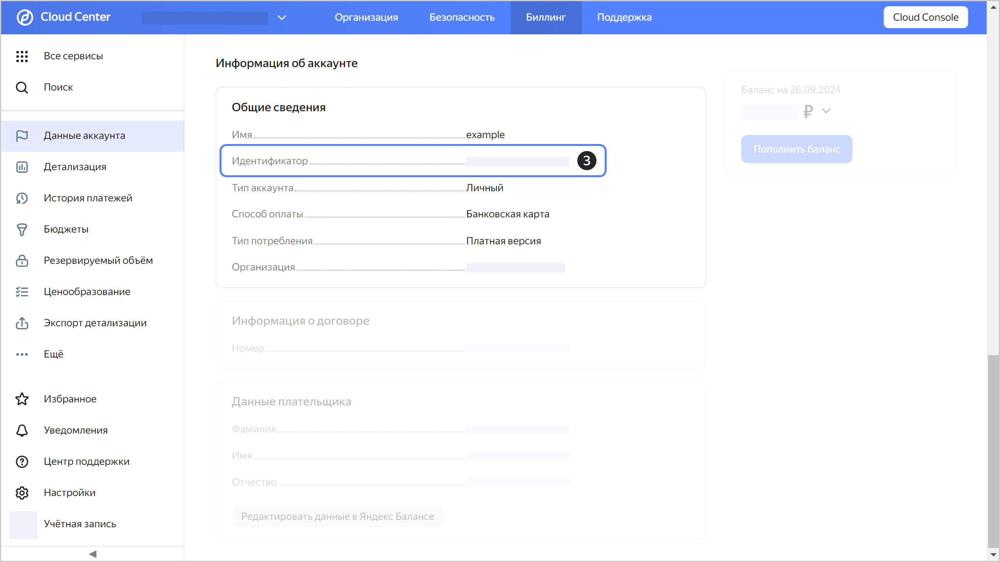



- {{ billing-interface }} {#billing}

  1. 
  1. Выберите аккаунт, идентификатор которого хотите узнать.
  1. Идентификатор платежного аккаунта отображается на странице **{{ ui-key.yacloud_billing.billing.account.switch_overview }}** в блоке **{{ ui-key.yacloud_billing.billing.account.overview.section_account-data }}**.
   
  


