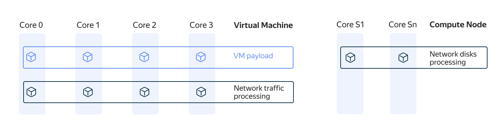
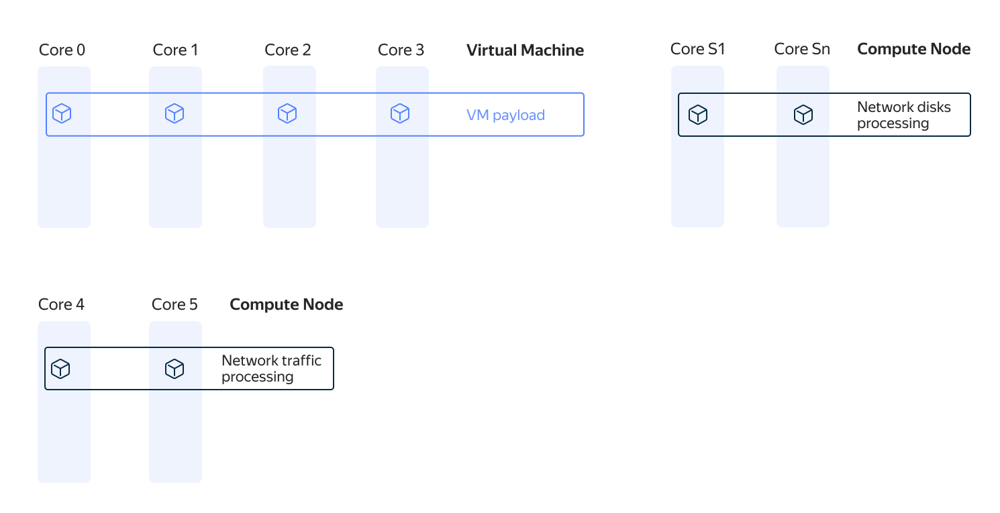

## Обычная сеть ВМ {#reg-vm}

В инфраструктуре {{ yandex-cloud }} все виртуальные машины работают в [среде виртуализации](../../glossary/virtualization.md) [QEMU-KVM](https://ru.wikipedia.org/wiki/QEMU). *Гипервизор* пропорционально распределяет вычислительную нагрузку по всем процессорным ядрам, которые выделены [виртуальной машине](../../glossary/vm.md).

Вычислительную нагрузку можно логически разделить на три части:

* Пользовательская нагрузка — процессы операционной системы и пользовательские процессы, которые запускаются в ОС пользовательской ВМ.
* Процессы, обеспечивающие работу [сетевых дисков](../../compute/concepts/disk.md).
* Процессы для обработки сетевого трафика ВМ.

Распределение нагрузки по вычислительным ядрам можно представить следующим образом:

На схеме видно, что пользовательская нагрузка и обработка сетевого трафика ВМ распределяются по всем вычислительным ядрам, которые выделены виртуальной машине.

Процессы, которые обеспечивают работу [сетевых дисков](../../compute/concepts/disk.md), отделены от пользовательской нагрузки и выполняются на вычислительных ядрах из отдельного пула, сервисных ядрах — на схеме они обозначены как `Core S1`, `Core Sn`.

Для изоляции обработки сетевого трафика ВМ от пользовательской нагрузки можно использовать механизм [программно-ускоренной сети](#san) (Software Accelerated Network, SAN).

## Программно-ускоренная сеть {#san}

*Программное ускорение сети* происходит за счет переноса процессов обработки сетевого трафика ВМ с вычислительных ядер [виртуальной машины](../../compute/concepts/vm.md) на дополнительные вычислительные ядра, которые выделяются из общего пула ядер, доступных физическому серверу. Для включения функции SAN требуется полная остановка ВМ.

Распределение нагрузки по вычислительным ядрам с включенным SAN можно представить следующим образом:

На схеме показано использование двух дополнительных вычислительных ядер — `Core 4` и `Core 5` для обработки сетевого трафика. Количество сервисных вычислительных ядер зависит от количества ядер ВМ:

* Если ВМ размещается на одном NUMA-узле физического сервера, то при включении SAN ей будет выделено 2 дополнительных вычислительных ядра для обработки сетевого трафика (показано на схеме).
* Если ВМ размещается на двух NUMA-узлах физического сервера, то при включении SAN ей будет выделено 4 дополнительных ядра.



Дополнительные вычислительные ядра, которые выделяются при включении SAN, не будут видны внутри пользовательской ВМ.

SAN нельзя включить для виртуальной машины с [уровнем производительности](../../compute/concepts/performance-levels.md) меньше 100%.



Таким образом, c помощью SAN исключается борьба пользовательской и сервисной нагрузок за аппаратные ресурсы, на которых работает ВМ — весь сетевой трафик ВМ обрабатывается отдельно. Благодаря этому снижаются задержки и потери пакетов при передаче трафика, а вычислительные ресурсы ВМ освобождаются для обслуживания пользовательской нагрузки.

[Стоимость](../../compute/pricing.md#software-accelerated-network) дополнительных аппаратных ресурсов зависит от [платформы](../../compute/concepts/vm-platforms.md) и количества ядер ВМ.

Чтобы включить программно-ускоренную сеть:

* включите опцию **{{ ui-key.yacloud.component.compute.resources.field_sw-accelerated-net }}** при [создании новой ВМ](../../compute/operations/vm-create/create-linux-vm.md) или [измените настройки](../../compute/operations/vm-control/vm-update-resources.md#enable-software-accelerated-network) существующей ВМ;

* включите опцию **{{ ui-key.yacloud.component.compute.resources.field_sw-accelerated-net }}** в конфигурации базовой ВМ при [создании группы ВМ](../../compute/operations/instance-groups/create-fixed-group.md) или в [YAML-спецификации](../../compute/concepts/instance-groups/specification.md) укажите для ключа `network_settings.type` значение `SOFTWARE_ACCELERATED`.

## Рекомендации по использованию программно-ускоренной сети {#use-cases}

Программно-ускоренную сеть рекомендуется включать для уменьшения времени обработки запросов:

* На ВМ с пользовательскими инсталляциями баз данных при интенсивной работе с [диском](../../compute/concepts/disk.md) и высокой утилизацией CPU (более 70-80%).
* Если внутри ВМ наблюдается большое значение метрики `CPU steal time`.
* В группах узлов кластеров [{{ managed-k8s-full-name }}](../../managed-kubernetes/concepts/index.md) при работе внутрикластерных балансировщиков L7, например [Ingress NGINX Controller](https://kubernetes.github.io/ingress-nginx/) или [Istio Ingress Gateways](https://istio.io/latest/docs/tasks/traffic-management/ingress/ingress-control/).



Включение SAN не поможет ускорить работу [сетевых дисков](../../compute/concepts/disk.md).


