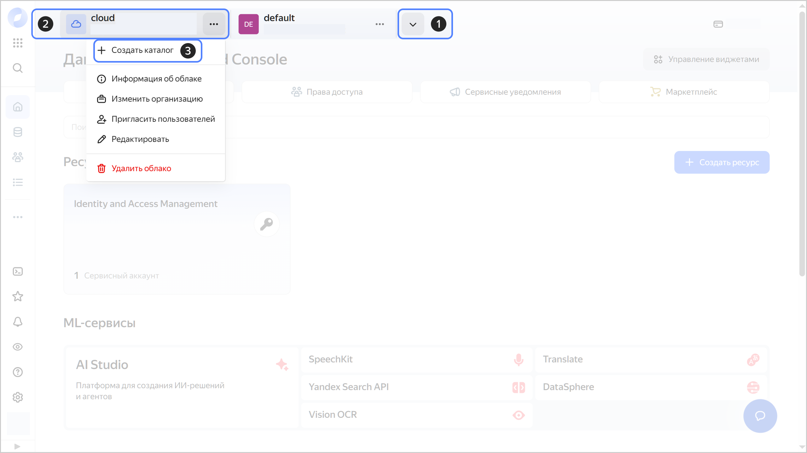
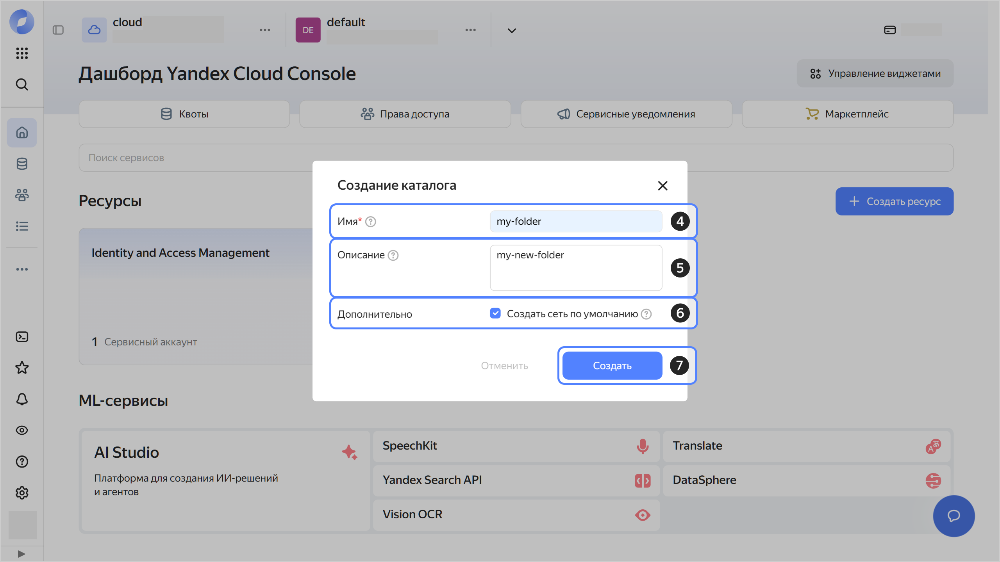

1. В [консоли управления]({{ link-console-main }}) на панели сверху нажмите  или  и выберите нужное [облако](../resource-manager/concepts/resources-hierarchy.md#cloud).
1. Справа от названия облака нажмите .
1. Выберите  **{{ ui-key.yacloud.component.console-dashboard.button_action-create-folder }}**.

   

1. Введите имя [каталога](../resource-manager/concepts/resources-hierarchy.md#folder). Требования к имени:

    

1. (Опционально) Введите описание каталога.
1. Выберите опцию **{{ ui-key.yacloud.iam.cloud.folders-create.field_default-net }}**. Будет создана [сеть](../vpc/concepts/network.md#network) с подсетями в каждой [зоне доступности](../overview/concepts/geo-scope.md). Также в этой сети будет создана [группа безопасности по умолчанию](../vpc/concepts/security-groups.md#default-security-group), которая разрешает подключение к ресурсам по `SSH` и `RDP`, входящий трафик по `ICMP`, а также любой исходящий трафик.
1. Нажмите **{{ ui-key.yacloud.iam.cloud.folders-create.button_create }}**.

   

