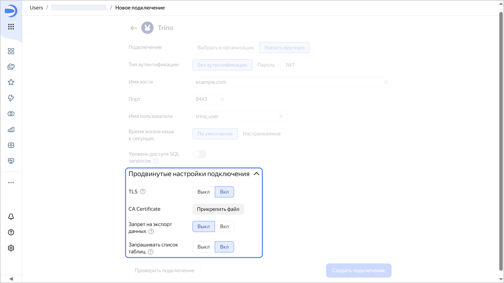

* **TLS** — когда опция включена, при взаимодействии с {{ TR }} используется протокол `HTTPS`, когда выключена — `HTTP`.
* **CA Certificate** — чтобы загрузить сертификат, нажмите кнопку **Прикрепить файл** и укажите файл сертификата. Когда сертификат загружен, поле отображает название файла.
* 
* 

