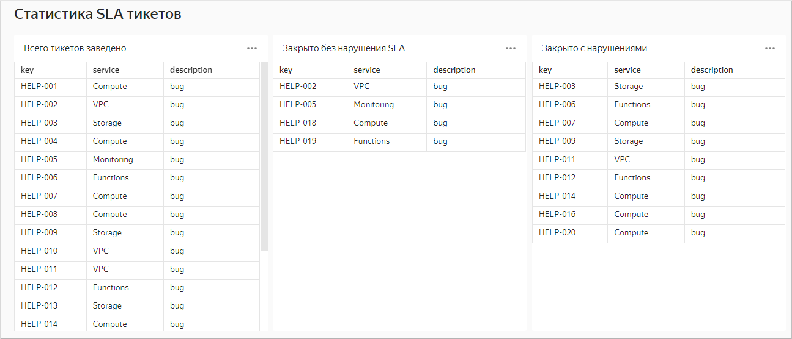



На дашборд **Статистика SLA тикетов** добавлен три раза один чарт:

* **Всего тикетов заведено** — чарт добавлен без параметра. Отображаются данные по всем тикетам.
* **Закрыто без нарушения SLA** — в настройках чарта на дашборде добавлен параметр `sla_failed` со значением `not_failed`. Отображаются данные только по тикетам, закрытым без нарушения SLA.
* **Закрыто с нарушениями** — в настройках чарта на дашборде добавлен параметр `sla_failed` со значением `failed`. Отображаются данные только по тикетам, закрытым с нарушением SLA.

