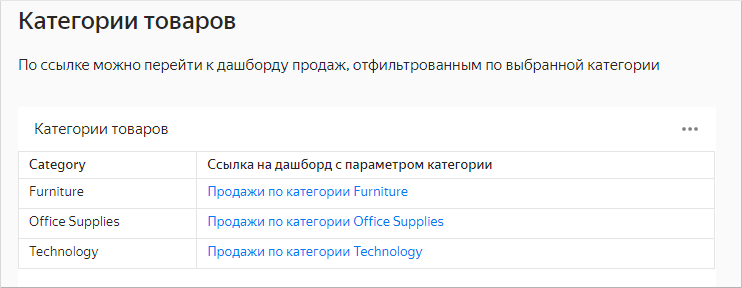
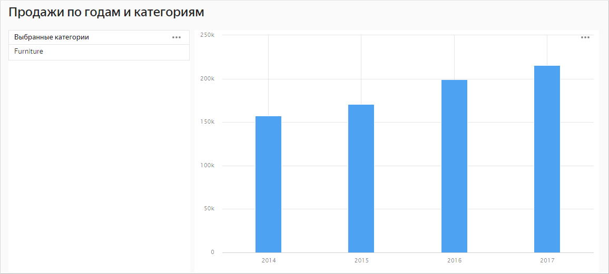



На дашборде [Категории товаров](https://datalens.yandex-team.ru/21nduux7am6ou-kategorii-tovarov) размещена таблица со списком категорий. 

Первая колонка таблицы содержит название категории, вторая — ссылку на дашборд [Продажи по годам и категориям](https://datalens.yandex-team.ru/tscm97gauiz6l-prodazhi-po-godam-i-kategoriyam), в настройках которого добавлен параметр `category`. В ссылке также указан параметр `category` со значением названия категории. При переходе по ссылке дашборд открывается с примененным фильтром по названию категории.

Например, при переходе по ссылке [https://datalens.yandex-team.ru/tscm97gauiz6l-prodazhi-po-godam-i-kategoriyam?category=Furniture](https://datalens.yandex-team.ru/tscm97gauiz6l-prodazhi-po-godam-i-kategoriyam?category=Furniture) откроется дашборд с примененным фильтром по категории `Furniture`.

