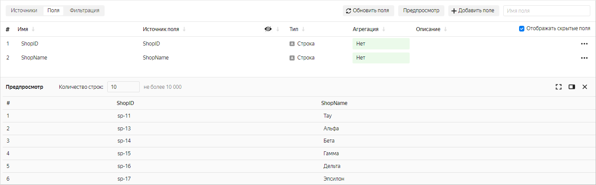

При создании связи между виджетами на дашборде может возникнуть ситуация, когда связь не работает. Обычно такое происходит, когда устанавливают связь между селектором и чартом, построенным по разным датасетам. Причина в том, что связь между виджетами устанавливается по полю, которое не используется при выборе значений в селекторе.

Рассмотрим такой случай на примере:

1\. На дашборде есть чарт `Sample - динамика продаж`, построенный по датасету `Sample CH Sales`.

   

   В датасете (чарте) есть поле `ShopID`, принимающее строковые значения: `sp-11`, `sp-18`, `sp-23` и т.п.

   

2\. Справочник магазинов — это датасет `Sample CH ShopList`. В нем есть два поля: `ShopID` и `ShopName`.

   

3\. Добавим на дашборд селектор по полю `ShopName` с названием магазина (`Тау`, `Дзета`, `Каппа`) из датасета `Sample CH ShopList`.

   

4\. Установим связь между селектором и чартом `Sample - динамика продаж` с помощью алиаса. По названию магазина связь установить не получается, так как названия магазина нет в датасете `Sample CH Sales`, на основе которого построен чарт.

   

   Поэтому установим связь по полю `ShopID`.

   

В результате выбор значений в селекторе никак не меняет отображаемый чарт, потому что связь между виджетами установлена по полю `ShopID`, а в селекторе выбираются значения поля `ShopName`.

Связь установлена неверно, потому что нельзя в селекторе на основе датасета использовать для выбора значений одно поле, а связь между датасетами устанавливать по другому полю. Такой механизм установления связей не поддерживается.
