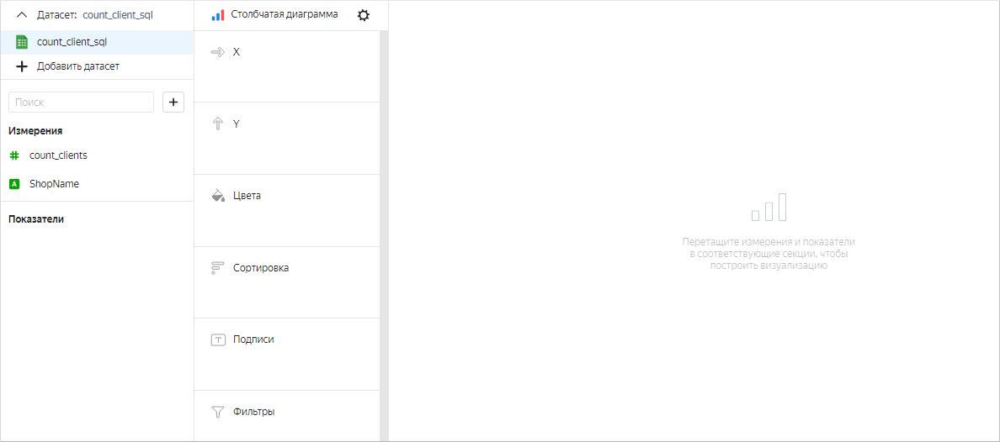
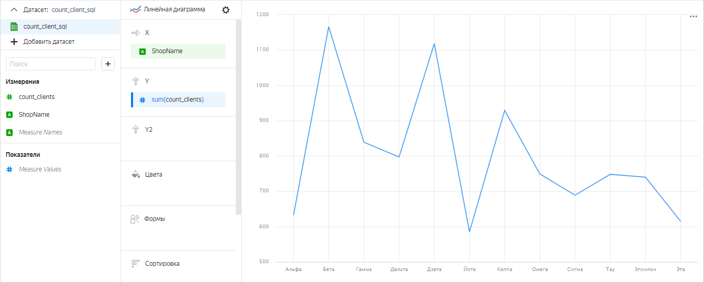
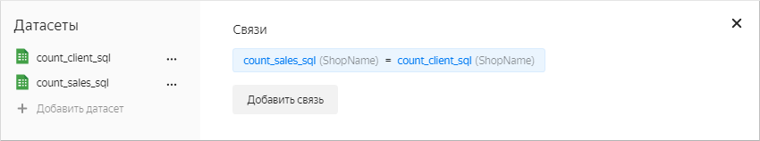
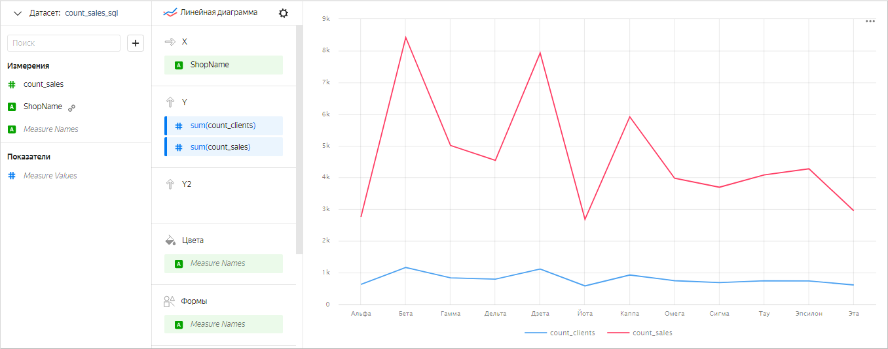
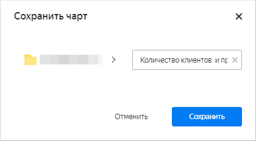

В качестве источника будет использована демонстрационная база данных ClickHouse с информацией о продажах товаров в сети московских магазинов.  Пример, как создать подключение смотрите в [сценарии](../../tutorials/datalens/data-from-ch-visualization.md#step1). 

1\. Подготовьте два датасета, используя [SQL-запрос к источнику данных](../../datalens/operations/dataset/add-data.md):

   * Текст SQL-запроса для датасета `count_client_sql`:

   ```sql
   SELECT samples.MS_Shops.ShopName, count(t2.ClientID) AS count_clients
   FROM samples.MS_Shops,
   (SELECT DISTINCT samples.MS_Shops.ShopID, samples.MS_Shops.ShopName, samples.MS_SalesFacts.ClientID
   FROM samples.MS_SalesFacts
   INNER JOIN samples.MS_Shops 
   ON samples.MS_Shops.ShopID=samples.MS_SalesFacts.ShopID) AS t2
   WHERE t2.ShopName=samples.MS_Shops.ShopName
   GROUP BY ShopName
   ```

   * Текст SQL-запроса для датасета `count_sales_sql`:

   ```sql
   SELECT DISTINCT samples.MS_Shops.ShopName, COUNT(*) AS count_sales
   FROM samples.MS_SalesFacts
   INNER JOIN samples.MS_Shops 
   ON samples.MS_Shops.ShopID=samples.MS_SalesFacts.ShopID
   GROUP BY ShopName
   ```

2\. На главной странице сервиса {{ datalens-full-name }} нажмите **Создать чарт**.
3\. В разделе **Датасет** выберите датасет `count_client_sql`.

   

4\. Выберите тип чарта **Линейная диаграмма**.
5\. Перетащите измерение `ShopName` из датасета в секцию **X**. Значения отобразятся в нижней части графика по оси X.
6\. Перетащите показатель `count_clients` из датасета в секцию **Y**. Значения отобразятся по оси Y в виде графика.

   

7\. Под списком датасетов нажмите **Добавить датасет** и выберите датасет `count_sales_sql`.
8\. В открывшемся окне автоматически установится связь по полю `ShopName`. Нажмите **Сохранить**.

   
   
9\. Перетащите показатель `count_sales` из датасета в секцию **Y**. Значения отобразятся по оси Y в виде второго графика.

   

10\. Вверху экрана нажмите **Сохранить**. В открывшемся окне введите название чарта `Количество клиентов  и продаж по магазинам — Линейная диаграмма` и нажмите **Сохранить**.

   
