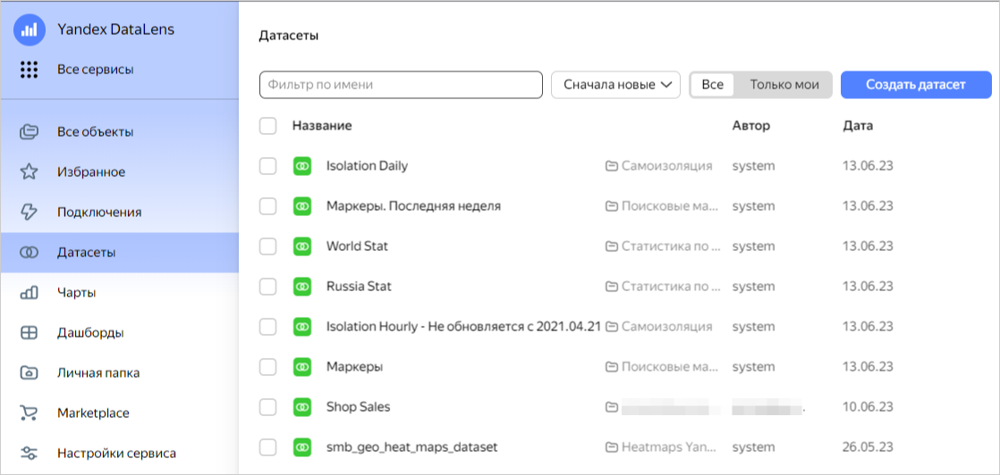
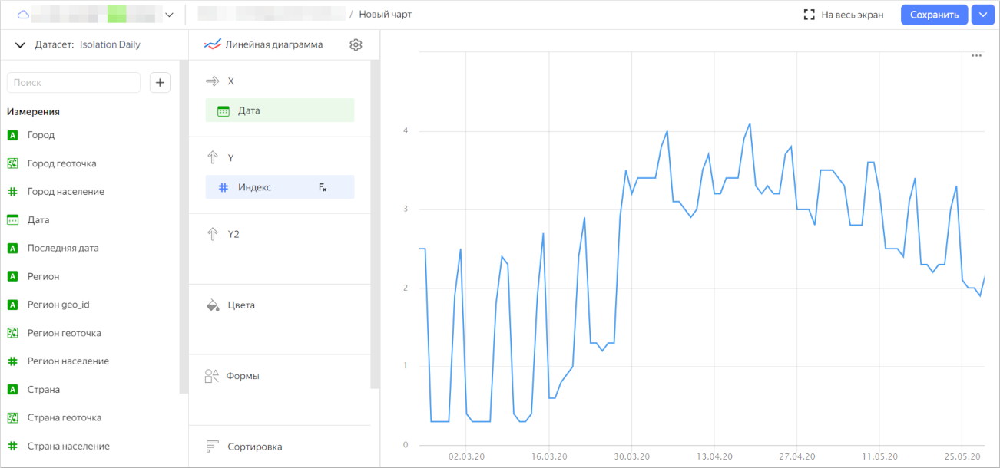
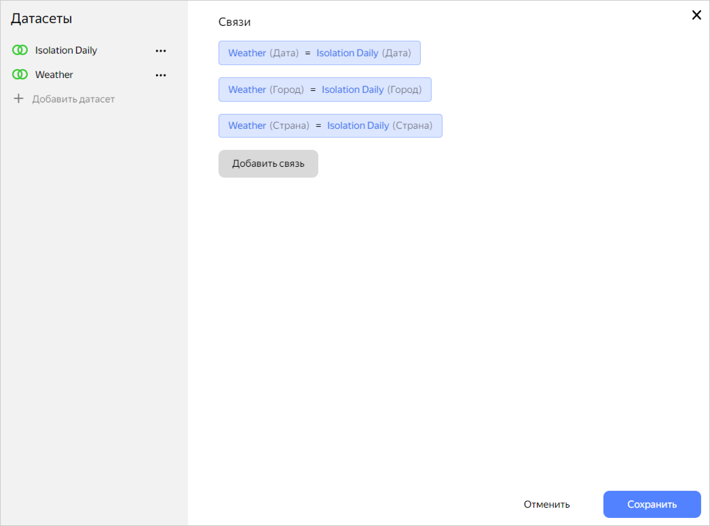
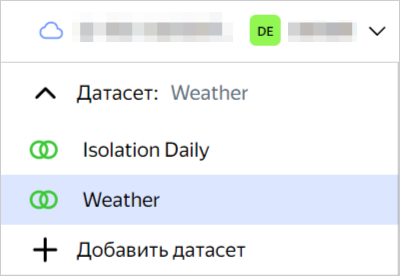
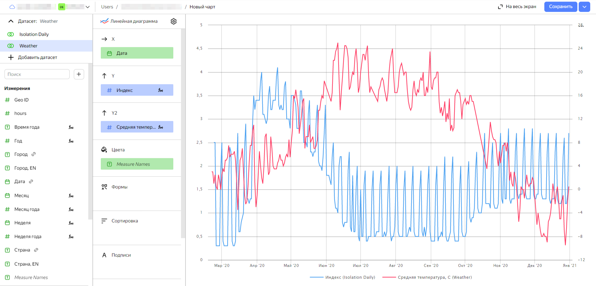

В качестве источника данных для примера будут использованы бесплатные датасеты из [маркетплейса](../../datalens/concepts/marketplace.md):

1. [Разверните](../../datalens/operations/marketplace/add-marketplace-product.md) из маркетплейса датасет **Коронавирус. Дашборд и данные**.
1. Аналогично предыдущему шагу разверните из маркетплейса датасет **Погода**.
1. Через левую панель навигации перейдите в раздел **Датасеты** и выберите датасет **Isolation Daily**.
   
   

1. Справа вверху нажмите кнопку **Создать чарт**.
1. Выберите тип чарта **Линейная диаграмма**.
1. Перетащите измерение `Дата` в секцию **X**.
1. Перетащите измерение `Город` в секцию **Фильтры**. Выберите значение, например, `Москва`.
1. Перетащите показатель `Индекс` в секцию **Y**. Полученный график отображает изменения индекса самоизоляции по Москве.

   

1. В левой верхней части экрана перед полем **Датасет: Isolation Daily** нажмите .
1. Нажмите кнопку **Добавить датасет** и выберите датасет **Weather**.
1. В открывшемся окне проверьте, что связи выставлены по полям `Дата`, `Город` и `Страна`.

   

1. В списке датасетов чарта выберите **Weather**.

   

1. Перетащите показатель `Средняя температура` в секцию **Y2**.
1. Перетащите измерение `Дата` в секцию **Фильтры**. Сформируйте условие `больше 21 Февраля 2020 г` (дата, с которой начал считаться индекс самоизоляции).
1. Справа вверху нажмите кнопку **Сохранить**. Введите название чарта и нажмите кнопку **Сохранить**.

Полученный чарт отображает визуализацию данных из двух датасетов и позволяет сопоставлять данные о погоде и самоизоляции.
