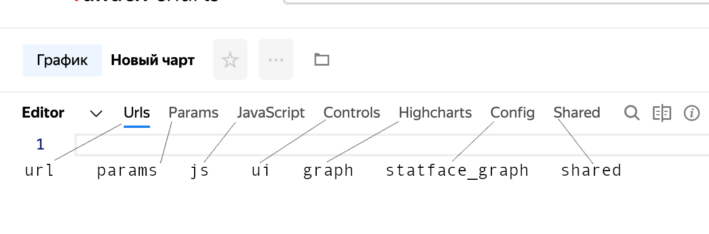
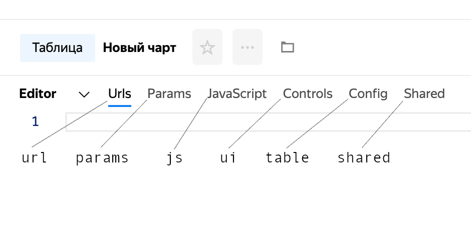
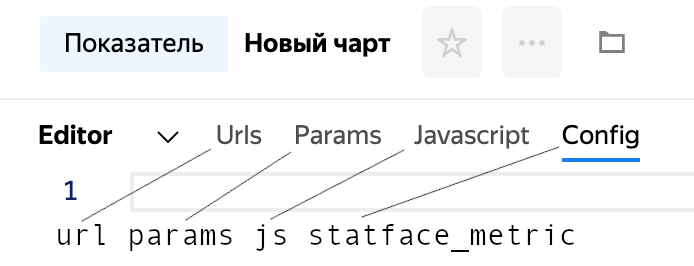
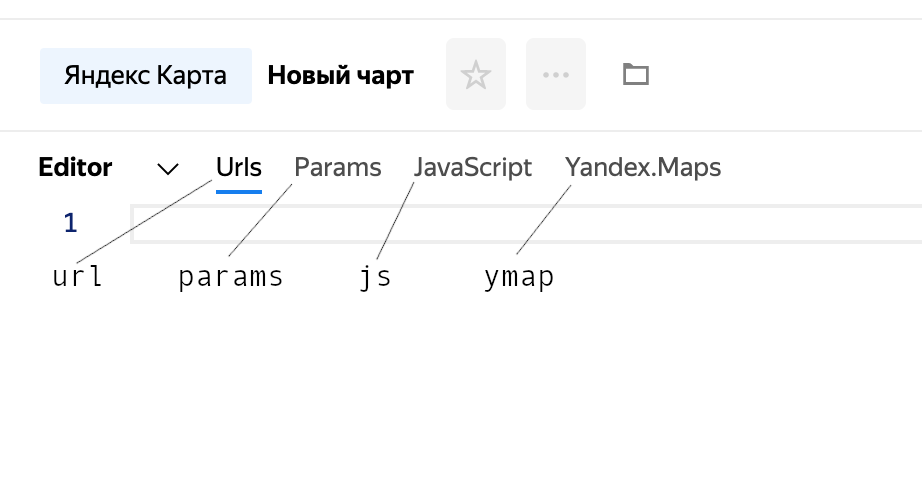
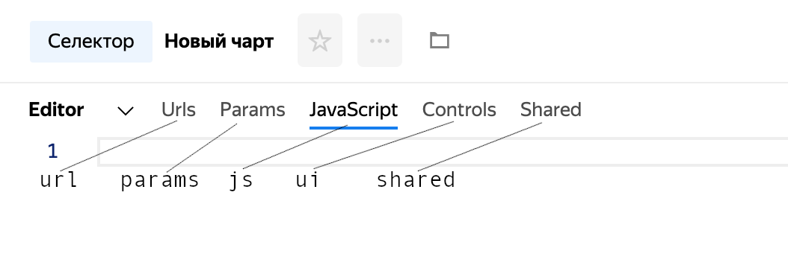
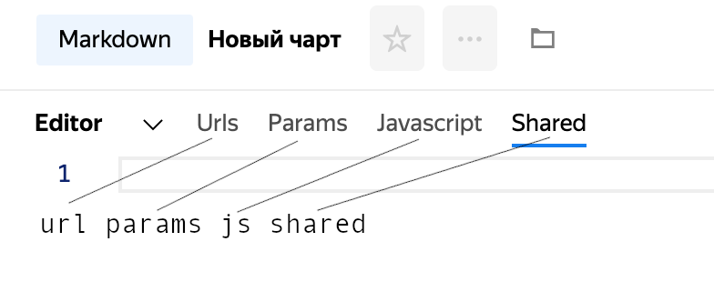
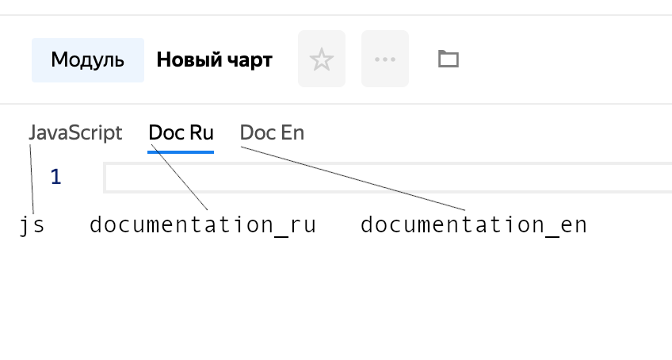

## Создание {#create}

[Аутентификация](../../../../datalens/api/dashboards/auth.md) • [Идентификация](../../../../datalens/api/dashboards/identification.md)

`POST` `https://api.charts.yandex.net/v1/charts`

### Формат тела запроса {#request-body-format-create}
```
{
    data: <Object — данные чарта>
    key: <String — ключ сущности в US>
    type¹: <String — тип чарта в ChartKit (например, "graph_node")>
    template¹: <String — тип шаблона для генерации генерируемого чарта (например, "datalens")>
}
```

¹ — необходимо указать только одно из двух

### Графики с `type`: {#charts-with-type-create}

Допустимые значения type:
* graph_node — график
* table_node — таблица
* metric_node — показатель
* ymap_node — карта
* control_node — селектор
* markdown_node — markdown виджет
* module — модуль

#### `graph_node` — график {#graph-node-create}
```
{
    // В data пишется содержимое вкладок
    url: "...",
    params: "...",
    js: "...",
    ui: "...",
    graph: "...",
    statface_graph: "...",
    shared: "..."
}
```



#### `table_node` — таблица {#table-node-create}
```
{
    // В data пишется содержимое вкладок
    url: "...",
    params: "...",
    js: "...",
    ui: "...",
    table: "...",
    shared: "..."
}
```



#### `metric_node` — показатель {#metric-node-create}
```
{
    // В data пишется содержимое вкладок
    url: "...",
    params: "...",
    js: "...",
    statface_metric: "..."
}
```



#### `ymap_node` — карта {#ymap-node-create}
```
{
    // В data пишется содержимое вкладок
    url: "...",
    params: "...",
    js: "...",
    ymap: "..."
}
```



#### `control_node` — селектор {#control-node-create}
```
{
    // В data пишется содержимое вкладок
    url: "...",
    params: "...",
    js: "...",
    ui: "...",
    shared: "..."
}
```



#### `markdown_node` — markdown виджет {#md-node-create}
```
{
    // В data пишется содержимое вкладок
    url: "...",
    params: "...",
    js: "...",
    shared: "..."
}
```



#### `module` — модуль {#module-create}
```
{
    // В data пишется содержимое вкладок
    js: "...",
    documentation_ru: "...",
    documentation_en: "..."
}
```



### Графики с `template`: {#charts-with-teplate-create}
В данный момент такие генерируемые графики используются для DataLens и Monitoring, их использовать не так просто, как классические графики, где все делается руками, но они позволяют быстро создавать графики с помощью других интерфейсов (например DataLens Wizard) вместо ChartsEditor.

### Формат ответа {#response-format-1-create}
```
{
    data: <Object — данные чарта>
    entryId: <String — id сущности в US>
    key: <String — ключ сущности в US>
    type: <String — тип чарта в ChartKit (например, "graph_node")>
}
```

### Пример запроса {#request-format-create}

```bash
curl --request POST \
  --url https://api.charts.yandex.net/v1/charts \
  --header "authorization: OAuth $CHARTS_OAUTH_TOKEN" \
  --header "content-type: application/json;charset=UTF-8" \
  --data '{
    "data": {
        "js": "const Dataset = require('\''libs/dataset/v1'\'');\nconst moment = require('\''vendor/moment/v2.21'\'');\nconst params = ChartEditor.getParams();\nconst loadedData = ChartEditor.getLoadedData();\nconsole.log(loadedData);\nconst preparedData = Dataset.processData(loadedData);\nconsole.log(preparedData);\nconst head = [    {        id: '\''category'\'',        name: '\''Category'\'',        type: '\''stirng'\''    },    {        id: '\''profit'\'',        name: '\''Profit'\'',        type: '\''number'\''    }];const rows = [];for (var i = 0; i < preparedData.length; i++) {    rows.push({        values: [            preparedData[i]['\''Category'\''],            preparedData[i]['\''Profit'\'']        ]    });}\nmodule.exports = {head, rows};",
        "ui": "",
        "url": "const Dataset = require('\''libs/dataset/v1'\'');\nconst moment = require('\''vendor/moment/v2.21'\'');\nconst DATE_FORMAT = '\''YYYY-MM-DD'\'';\nconst params = ChartEditor.getParams();\nconst datasetSource = Dataset.buildSource({    id: '\''y55xt5d3p9csw'\'',    columns: ['\''Category'\'', '\''Profit'\''],    where: [{        column: '\''Renamed date'\'',        operation: '\''GTE'\'',        values: ['\''2017-01-01 00:00:00'\'']    }]});\nmodule.exports = {    dataset: datasetSource};",
        "table": "module.exports = {    title: {        text: '\''Таблица со случайными данными'\'',        style: {            '\''text-align'\'': '\''center'\'',            '\''font-size'\'': '\''16px'\'',            '\''color'\'': '\''#31C733'\''        }    },    sort: '\''date'\'',    order: '\''asc'\''};",
        "params": "module.exports = {    count: 8};",
        "shared": ""
    },
    "key": "Users/apanchuk/brandNewChart",
    "type": "table_node"
}'
```

### Пример ответа {#response-format-2-create}

```json
{
  "entryId": "ogo5x8piotxul",
  "data": {
    "js": "const Dataset = require('libs/dataset/v1');\nconst moment = require('vendor/moment/v2.21');\nconst params = ChartEditor.getParams();\nconst loadedData = ChartEditor.getLoadedData();\nconsole.log(loadedData);\nconst preparedData = Dataset.processData(loadedData);\nconsole.log(preparedData);\nconst head = [    {        id: 'category',        name: 'Category',        type: 'stirng'    },    {        id: 'profit',        name: 'Profit',        type: 'number'    }];const rows = [];for (var i = 0; i < preparedData.length; i++) {    rows.push({        values: [            preparedData[i]['Category'],            preparedData[i]['Profit']        ]    });}\nmodule.exports = {head, rows};",
    "ui": "",
    "url": "const Dataset = require('libs/dataset/v1');\nconst moment = require('vendor/moment/v2.21');\nconst DATE_FORMAT = 'YYYY-MM-DD';\nconst params = ChartEditor.getParams();\nconst datasetSource = Dataset.buildSource({    id: 'y55xt5d3p9csw',    columns: ['Category', 'Profit'],    where: [{        column: 'Renamed date',        operation: 'GTE',        values: ['2017-01-01 00:00:00']    }]});\nmodule.exports = {    dataset: datasetSource};",
    "table": "module.exports = {    title: {        text: 'Таблица со случайными данными',        style: {            'text-align': 'center',            'font-size': '16px',            'color': '#31C733'        }    },    sort: 'date',    order: 'asc'};",
    "params": "module.exports = {    count: 8};",
    "shared": ""
  },
  "key": "Users/apanchuk/brandNewChart",
  "meta": {},
  "scope": "widget",
  "type": "table_node",
  "public": false,
  "createdAt": "2019-12-04T17:51:10.517Z",
  "createdBy": "apanchuk",
  "updatedAt": "2019-12-04T17:51:11.112Z",
  "updatedBy": "apanchuk"
}
```
