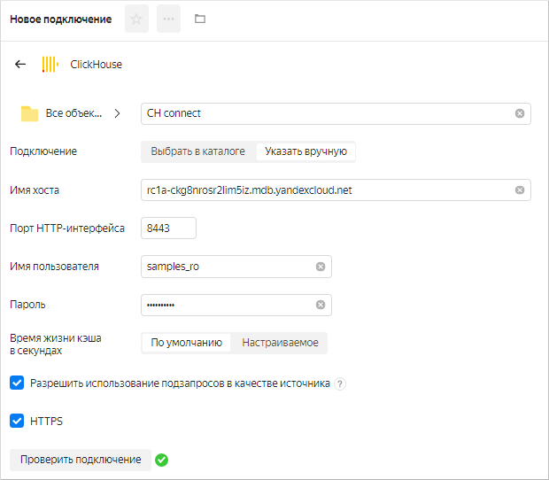

1. Перейдите на [страницу подключений]({{ link-datalens-main }}/connections).
1. Нажмите кнопку **Создать подключение**.
1. Выберите подключение **ClickHouse**.

    1. В открывшемся окне укажите параметры подключения:

       * Название подключения — `CH connect`.
       * Подключение — тип **Указать вручную**.
       * Имя хоста —  `rc1a-ckg8nrosr2lim5iz.{{ dns-zone }}`.
       * Порт HTTP-интерфейса — `8443` (по умолчанию).
       * Имя пользователя — `samples_ro`.
       * Пароль — `MsgfcjEhJk`.

    1. Активируйте опции **HTTPS** и **Разрешить использование подзапросов в качестве источника**.  
    1. Проверьте подключение и нажмите кнопку **Создать**.

    

Дождитесь сохранения подключения.
