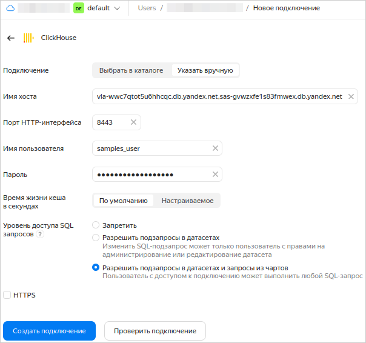

1. Перейдите на [страницу подключений]({{ link-datalens-main }}/connections).Перейдите на страницу воркбука.
1. Нажмите кнопку **Создать подключение**.В правом верхнем углу нажмите **Создать** → **Подключение**.
1. Выберите подключение **ClickHouse**.

   
   
   1. В открывшемся окне укажите параметры подключения:

      * Подключение — тип **Указать вручную**.
      * Имя хоста —  `rc1a-ckg8nrosr2lim5iz.{{ dns-zone }}`.
      * Порт HTTP-интерфейса — `8443` (по умолчанию).
      * Имя пользователя — `samples_ro`.
      * Пароль — `MsgfcjEhJk`.

    1. Активируйте опции **HTTPS** и **Разрешить подзапросы в датасетах и запросы из чартов**.
    1. Проверьте подключение и нажмите кнопку **Создать подключение**.
    1. Введите название подключения — `Sample ClickHouse`.
    1. Нажмите кнопку **Создать**.

      

   

   1. В открывшемся окне укажите параметры подключения:
     
      * Подключение — тип **Указать вручную**.
      * Имя хоста — `vla-wwc7qtot5u6hhcqc.db.yandex.net,sas-gvwzxfe1s83fmwex.db.yandex.net`.
      * Порт HTTP-интерфейса — `8443` (по умолчанию).
      * Имя пользователя — `samples_user`.
      * Пароль — `ilovesamplessomuch`.

   1. Активируйте опцию **Разрешить подзапросы в датасетах и запросы из чартов**.
   1. Проверьте подключение и нажмите кнопку **Cоздать подключение**.
   1. Введите название подключения — `Sample ClickHouse`.
   1. Нажмите кнопку **Создать**.

      

   

Дождитесь сохранения подключения.
