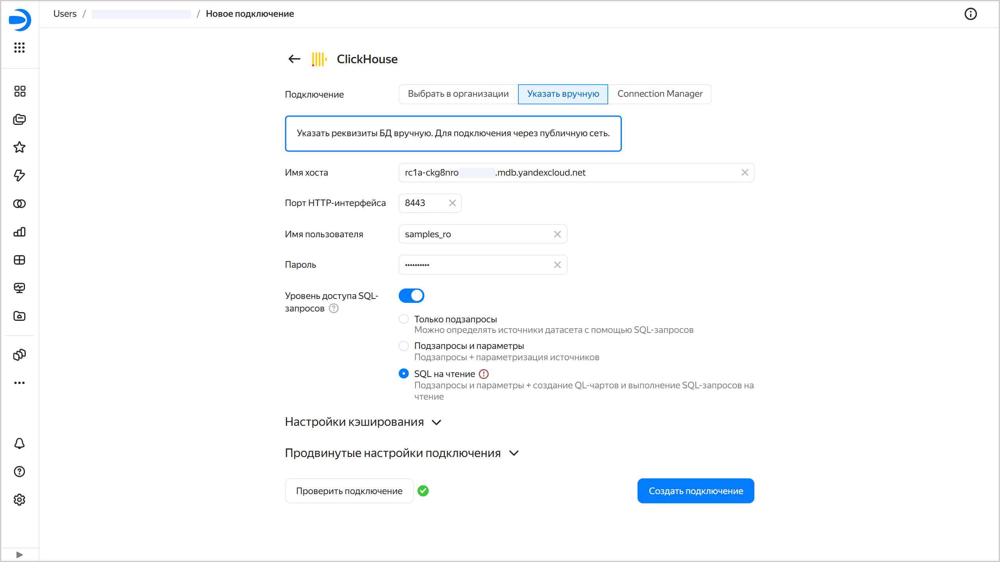



1. Перейдите на [страницу подключений]({{ link-datalens-main }}/connections).
1. Нажмите кнопку **Создать подключение**.

1. Выберите подключение **ClickHouse**.

   
   1. В открывшемся окне укажите параметры подключения:

      * Подключение — тип **Указать вручную**.
      * Имя хоста — `rc1a-ckg8nrosr2lim5iz.mdb.yandexcloud.net`.
      * Порт HTTP-интерфейса — `8443` (по умолчанию).
      * Имя пользователя — `samples_ro`.
      * Пароль — `MsgfcjEhJk`.

    1. Активируйте опцию **Уровень доступа SQL-запросов** → **SQL на чтение**.

    1. Нажмите кнопку **Проверить подключение** и убедитесь, что появился зеленый значок.

                   
       

    1. Нажмите кнопку **Создать подключение**.
    1. Введите название подключения — `Sample ClickHouse`.
    1. Нажмите кнопку **Создать**.

Дождитесь сохранения подключения.
