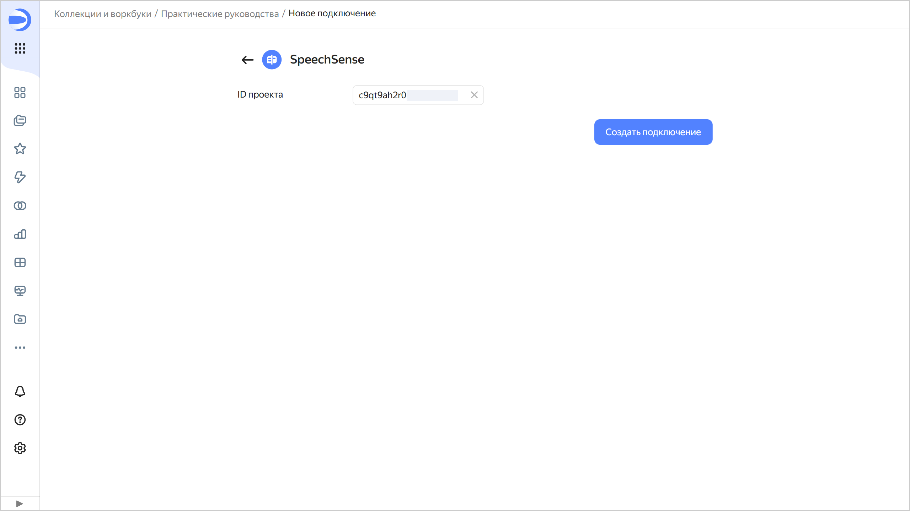

1. Перейдите на [главную страницу]({{ link-datalens-main }}) {{ datalens-short-name }}.
1. На панели слева выберите  **Коллекции и воркбуки** и откройте нужный воркбук или [создайте](../../../datalens/workbooks-collections/workbooks-collections-create.md) новый. Если вы пользуетесь старой навигацией по папкам, выберите папку или создайте новую для сохранения [подключения](../../../datalens/concepts/connection.md).

1. В правом верхнем углу нажмите **Создать** →  **Подключение**.
1. В разделе **Файлы и сервисы** выберите подключение **{{ speechsense-name }}**.
1. Скопируйте идентификатор нужного [проекта](../../../speechsense/concepts/resources-hierarchy.md#project) {{ speechsense-name }} и вставьте в поле **ID проекта**.
   
1. Оставьте опцию **Автоматически создать дашборд, чарты и датасет над подключением** включенной, если хотите получить готовый дашборд, датасет и стандартный набор чартов.

   

1. Нажмите кнопку **Создать подключение**.
1. Укажите название подключения и нажмите кнопку **Создать**.



Если проекта с указанным идентификатором не существует или у пользователя нет к нему доступа, подключение не будет создано и отобразится ошибка.

