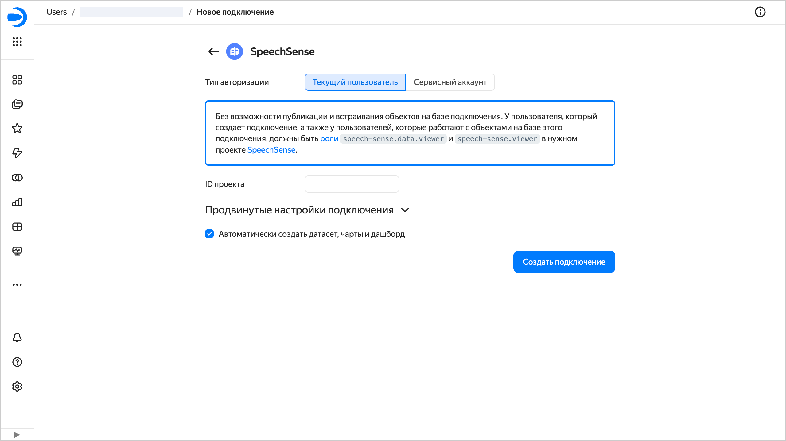
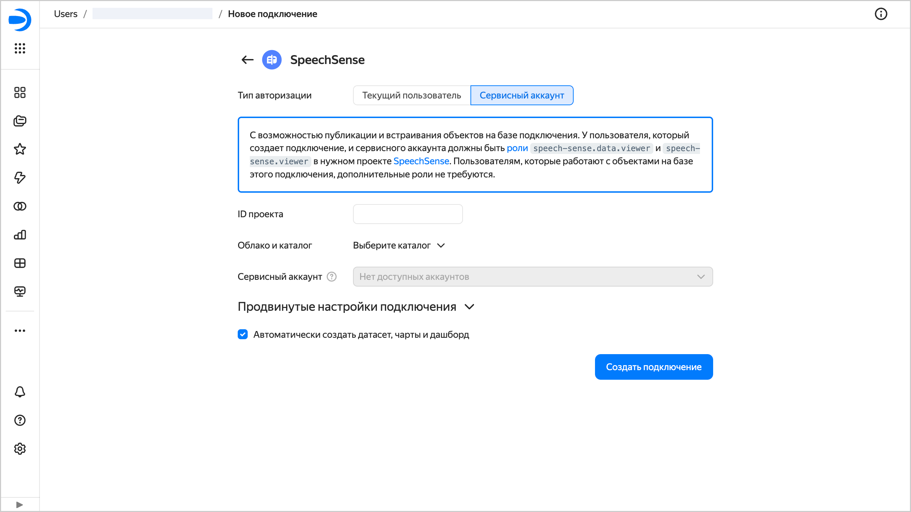

1. Перейдите на [главную страницу]({{ link-datalens-main-skip-promo }}) {{ datalens-short-name }}.
1. На панели слева выберите  **Коллекции и воркбуки** и откройте нужный воркбук или [создайте](../../../datalens/workbooks-collections/workbooks-operations.md#create-workbook) новый. Если вы пользуетесь старой навигацией по папкам, выберите папку или создайте новую для сохранения [подключения](../../../datalens/concepts/connection/index.md).
1. В правом верхнем углу нажмите **Создать** →  **Подключение**.
1. В разделе **Файлы и сервисы** выберите подключение **{{ speechsense-name }}**.
1. Выберите режим авторизации и укажите параметры подключения:

   

   - Текущий пользователь {#user}

     

     1. Скопируйте идентификатор нужного [проекта](../../../speechsense/concepts/resources-hierarchy.md#project) {{ speechsense-name }} и вставьте в поле **ID проекта**.
     1. Оставьте опцию **Автоматически создать датасет, чарты и дашборд** включенной, если хотите получить готовый дашборд, датасет и стандартный набор чартов.

        

     1. Нажмите кнопку **Создать подключение**.
     1. Укажите название подключения и нажмите кнопку **Создать**.

     

     Если проекта с указанным идентификатором не существует или у пользователя нет к нему доступа, подключение не будет создано и отобразится ошибка.

     

   - Сервисный аккаунт {#service-account}

     
 
     1. Скопируйте идентификатор нужного [проекта](../../../speechsense/concepts/resources-hierarchy.md#project) {{ speechsense-name }} и вставьте в поле **ID проекта**.
     1. Выберите облако и каталог в нем.
     1. Выберите существующий сервисный аккаунт или создайте новый.      
     1. Оставьте опцию **Автоматически создать датасет, чарты и дашборд** включенной, если хотите получить готовый дашборд, датасет и стандартный набор чартов.

        

     1. Нажмите кнопку **Создать подключение**.
     1. Укажите название подключения и нажмите кнопку **Создать**.

     

     Если проекта с указанным идентификатором не существует или у сервисного аккаунта нет к нему доступа, подключение не будет создано и отобразится ошибка.

     

   
