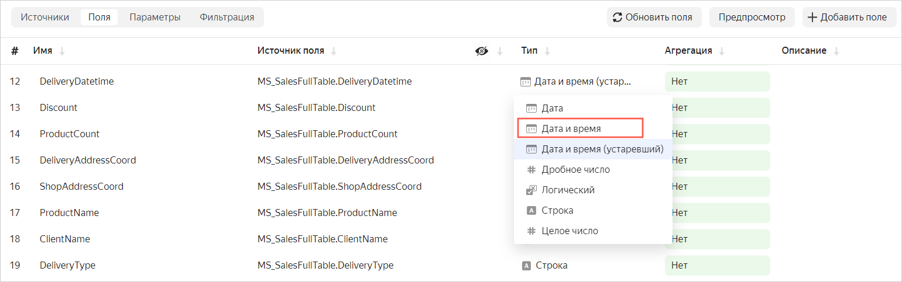
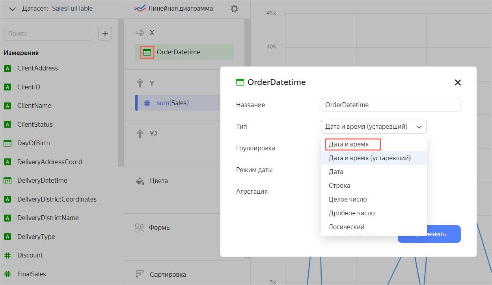

### Как перейти к новому типу Дата и время? {#new-datetime}

При создании {{ datalens-short-name }} было решено в операциях над полями `Дата и время` приводить их к [UTC](https://ru.wikipedia.org/wiki/Всемирное_координированное_время)).

> Например, если в базе хранится значение `2022-08-30 10:07:15` по московскому времени (UTC+3), в {{ datalens-short-name }} оно отобразится с разницей в 3 часа: `2022-08-30 07:07:15`.

Из-за этого в некоторых чартах вам приходилось вручную добавлять смещение. Такая реализация `Даты и времени`, с автоматическим приведением к UTC, без явного уведомления пользователей, оказалась неудачной, поэтому мы переходим к новому формату даты времени, без приведения к UTC.

**Этапы перехода**

* С 6 сентября 2022 года:
   * Переименовали исходный тип даты и времени в [Дата и время (устаревший)](../../../datalens/concepts/data-types.md#datetime-old).
   * Добавили новый тип [Дата и время](../../../datalens/concepts/data-types.md#datetime), без приведения к UTC.
   * Добавили новые функции приведения [GENERICDATETIME](../../../datalens/function-ref/GENERICDATETIME.md) и [GENERICDATETIME_PARSE](../../../datalens/function-ref/GENERICDATETIME_PARSE.md), без автоматических преобразований внутри.
   * Ввели новый литерал `##...##` для обозначения константных значений без приведения к UTC.

* 12 октября 2022 года:

   * Во всех датасетах поля с типом `Дата и время (устаревший)` будут заменены на поля с типом `Дата и время`.
   * Использование знака решетки `#` перестанет приводить константы к UTC.
   * Функции [DATETIME](../../../datalens/function-ref/DATETIME.md) и [DATETIME_PARSE](../../../datalens/function-ref/DATETIME_PARSE.md) перестанут приводить выражения к UTC.

**Как перейти** 

Если на чарте появилось предупреждение об использовании устаревшего типа даты и времени, смените тип полей с [Дата и время (устаревший)](../../../datalens/concepts/data-types.md#datetime-old) на [Дата и время](../../../datalens/concepts/data-types.md#datetime):

1. Перейдите из чарта в датасет:

   

   - Чарт на дашборде
   
     1. В правом верхнем углу чарта нажмите значок  и выберите **Инспектор**.
     1. Нажмите ссылку в блоке **Источники данных**.

   - Редактор чарта

     В левом верхнем углу рядом с названием датасета нажмите значок  и выберите **Перейти к датасету**.

   

2. Для полей с типом `Дата и время (устаревший)` измените тип на `Дата и время`.

   

3. В вычисляемых полях замените:

   * функцию [DATETIME](../../../datalens/function-ref/DATETIME.md) на [GENERICDATETIME](../../../datalens/function-ref/GENERICDATETIME.md). 
   * функцию [DATETIME_PARSE](../../../datalens/function-ref/DATETIME_PARSE.md) на [GENERICDATETIME_PARSE](../../../datalens/function-ref/GENERICDATETIME_PARSE.md).
   * литерал `#` на `##`.

4. Сохраните датасет.
5. Вернитесь в чарт и проверьте, осталось ли предупреждение об использовании устаревшего типа данных.
6. Если предупреждение осталось, измените тип полей в чарте:

   1. В настройках поля в секции визуализации измените тип с `Дата и время (устаревший)` на `Дата и время`.
      
      

   2. Сохраните чарт.
7. Проверьте, что на графиках отображаются корректные данные.

Чтобы убедиться, что приведение к UTC не выполняется, проверьте запрос из чарта в источник данных:

1. В правом верхнем углу чарта нажмите значок  и выберите **Инспектор**.
1. В разделе **Дополнительная информация** блока **Источники данных** просмотрите текст запроса.
1. Проверьте, что в запросе нет явного приведения даты и времени к UTC.
   
   

   

   

1. Если явного приведения к UTC нет, то скопируйте запрос и выполните его непосредственно в источнике данных. Сравните результаты с данными на чарте.
