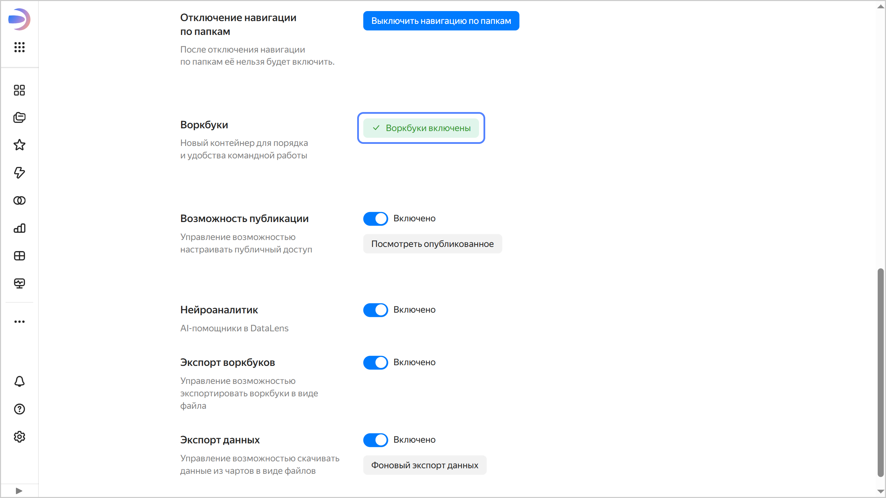



* Включить воркбуки может пользователь с ролью `{{ roles-datalens-admin }}`. При этом экземпляр {{ datalens-short-name }} должен быть развернут на уровне [организации](../../../datalens/concepts/organizations.md).
* В новых экземплярах {{ datalens-short-name }} доступны только воркбуки и коллекции.



Чтобы начать работать с воркбуками:

1. На панели слева выберите  **Настройки сервиса**.
1. Выберите вкладку **Навигация**.
1. В разделе **Воркбуки** нажмите кнопку **Включить воркбуки**.

   

   

   
