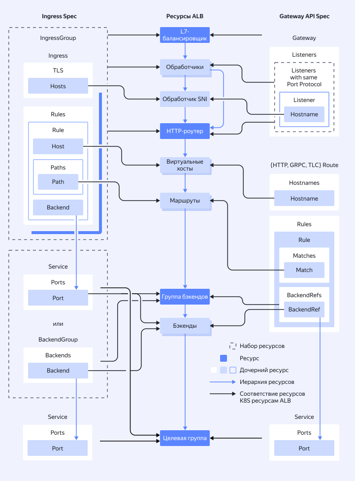

# Контроллер Gwin для {{ managed-k8s-full-name }}

{{ alb-full-name }} предоставляет инструмент для создания балансировщиков нагрузки и управления ими в [кластерах {{ managed-k8s-full-name }}](../../../managed-kubernetes/concepts/index.md#kubernetes-cluster) — Gwin.

Контроллер Gwin, установленный в кластер, автоматически разворачивает [L7-балансировщики](../../../application-load-balancer/concepts/application-load-balancer.md) на основе конфигурации созданных вами ресурсов {{ k8s }}.

Контроллер поддерживает спецификации [Ingress](https://kubernetes.io/docs/concepts/services-networking/ingress/) и [Gateway API](https://gateway-api.sigs.k8s.io/). Для настройки дополнительных возможностей {{ alb-name }}, выходящих за рамки спецификации {{ k8s }}, реализован механизм [политик](../../../managed-kubernetes/alb-ref/gwin-policies.md), которые управляются с помощью [CustomResourceDefinitions](https://kubernetes.io/docs/tasks/extend-kubernetes/custom-resources/custom-resource-definitions/) или аннотаций. К дополнительным возможностям относятся, например, автомасштабирование, логирование и интеграция с [{{ sws-full-name }}](../../../smartwebsecurity/concepts/index.md).

Поддерживаемые ресурсы {{ k8s }}:



Схема работы контроллера Gwin:



Установить контроллер Gwin можно [по инструкции](../../..//managed-kubernetes/alb-ref/gwin-quickstart.md).

## Примеры конфигурации

Ниже приведены два примера конфигурации — с использованием ресурсов Gateway API и Ingress. В обоих случаях создается балансировщик {{ alb-name }}, который:

  * автоматически получает динамический публичный IP-адрес;
  * принимает HTTP-трафик на порт `80`;
  * принимает HTTPS-трафик на порт `443`, используя сертификат {{ certificate-manager-name }};
  * отправляет GET-запросы к тестовому сервису `example-service`.



  - Gateway API {#gw}

      ```yaml
      apiVersion: gateway.networking.k8s.io/v1
      kind: Gateway
      metadata:
        name: example-gateway
        namespace: example-ns
      spec:
        gatewayClassName: gwin-default
        listeners:
          - name: http
            protocol: HTTP
            port: 80
            hostname: "example.com"
            allowedRoutes:
              namespaces:
                from: Same
          - name: https
            protocol: HTTPS
            port: 443
            hostname: "example.com"
            allowedRoutes:
              namespaces:
                from: Same
            tls:
              certificateRefs:
                - group: gwin.yandex.cloud
                  kind: YCCertificate
                  name: example-certificate
        addresses:
          - type: gwin.yandex.cloud/autoIPv4
            value: auto
      ---
      apiVersion: gateway.networking.k8s.io/v1
      kind: HTTPRoute
      metadata:
        name: example-redirect-httproute
        namespace: example-ns
      spec:
        hostnames:
          - "example.com"
        parentRefs:
          - name: example-gateway
            sectionName: http
        rules:
          - filters:
              - type: RequestRedirect
                requestRedirect:
                  scheme: https
                  statusCode: 301
      ---
      apiVersion: gateway.networking.k8s.io/v1
      kind: HTTPRoute
      metadata:
        name: example-httproute
        namespace: example-ns
      spec:
        hostnames:
          - "example.com"
        parentRefs:
          - name: example-gateway
            sectionName: https
        rules:
          - matches:
              - path:
                  value: /api
                  type: PathPrefix
                method: GET
            backendRefs:
              - kind: Service
                name: example-service
                port: 80
      ---
      apiVersion: gwin.yandex.cloud/v1
      kind: YCCertificate
      metadata:
        name: example-certificate
        namespace: example-ns
      spec:
        certificateRef:
          certificateID: "<идентификатор_сертификата>"
      ```

  - Ingress {#ingress}

      ```yaml
      apiVersion: networking.k8s.io/v1
      kind: Ingress
      metadata:
        name: example-ingress
        namespace: example-ns
        annotations:
          gwin.yandex.cloud/groupName: example
          gwin.yandex.cloud/externalIPv4Address: auto
          gwin.yandex.cloud/rules.allowedMethods: "GET"
      spec:
        ingressClassName: gwin-default
        rules:
          - host: example.com
            http:
              paths:
                - pathType: Prefix
                  path: "/api"
                  backend:
                    service:
                      name: example-service
                      port:
                        number: 80
        tls:
          - hosts:
              - example.com
            secretName: "yc-certmgr-cert-id-<идентификатор_сертификата>"
      ```



