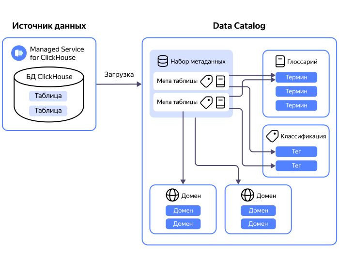

Каталог метаданных одновременно является:

* местом сбора и хранения метаданных из различных источников;
* рабочим пространством для разметки метаданных. 

Метаданные загружаются в каталог при помощи [источников и загрузок](#metadata-upload). Для метаданных создается [хранилище данных](#data-store), которое объединяет метаданные источников, относящихся к одному кластеру управляемых баз данных или одной пользовательской инсталляции базы данных.

Для первичного распределения метаданных, например по отделам компании, применяются [домены и поддомены](#domains-and-subdomains). Для более детальной разметки метаданных вы можете использовать:

* [классификации и теги](#classifications-and-tags),
* [глоссарии и термины](#glossaries-and-terms).

