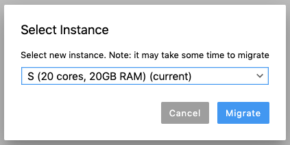

Чтобы сменить конфигурацию виртуальной машины:

1. Нажмите кнопку **Migrate to another instance** в меню на вкладке ноутбука.
1. Выберите конфигурацию.

    
1. Дождитесь, когда рядом с кнопкой **Migrate to another instance** появится статус **State loaded**. Смена конфигурации занимает от 1 до 3 минут — в это время для проекта запускается виртуальная машина.

