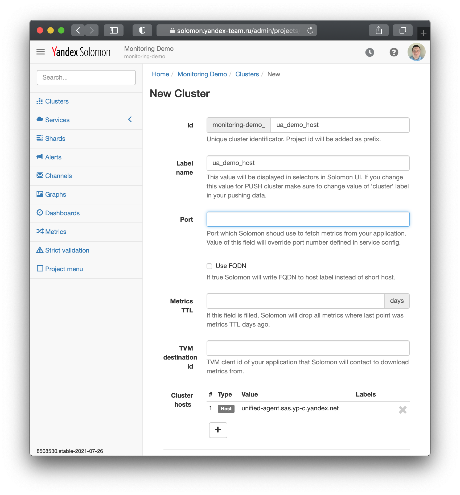
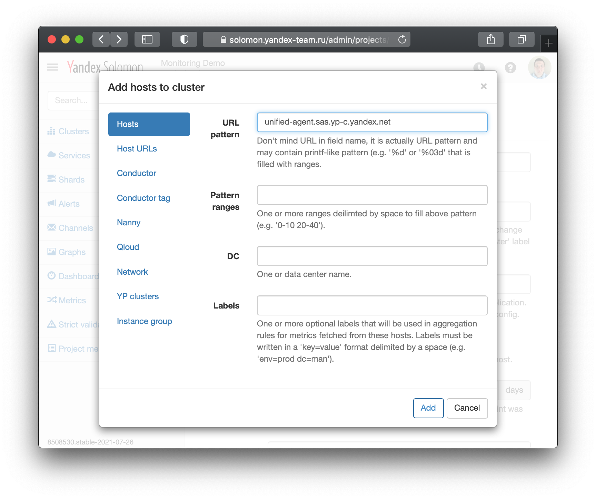
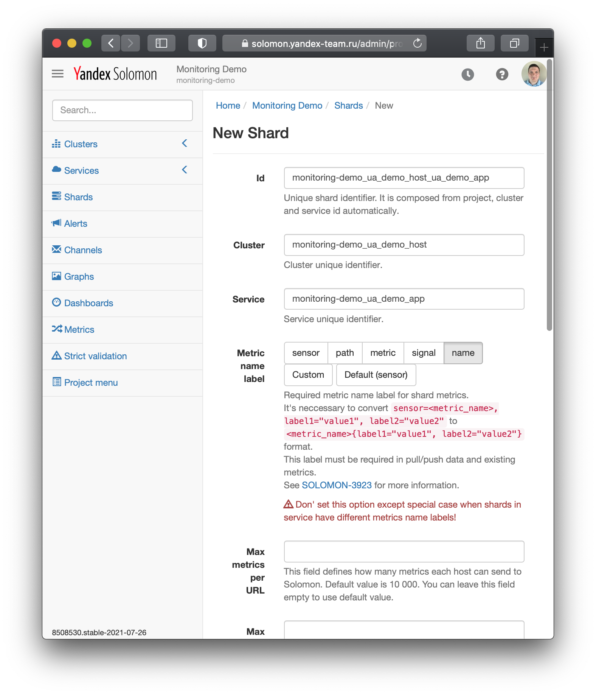
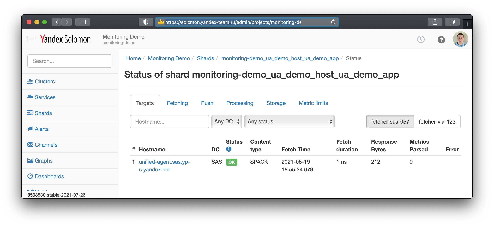

Завершите создание кластера нажатием кнопки _Create_.

После создания кластера нажмите кнопку _Resolve_ в блоке _Cluster hosts_ и убедитесь, что в списке появились все добавленные хосты.

<small>Рисунок 3 — Заполненная форма создания кластера.</small>

<small>Рисунок 4 — Заполненная форма добавления хоста в кластер.</small>

### Создание шарда {#shard}
Создайте шард:
1. Откройте раздел _Shards_;
1. Откройте форму создания шарда при помощи кнопку _Create new_;
1. Введите следующие параметры шарда:
    - _Service_: выберите из списка созданный ранее сервис `demo_app`;
    - _Cluster_: выберите из списка созданный ранее кластер `demo_host`;
    - значение идентификатора шарда сгенерируется автоматически;
    - остальные поля заполнять не требуется.

<small>Рисунок 4 — Заполненная форма создания шарда.</small>

На открывшейся странице просмотра свойств шарда перейдите по ссылке Shard status внизу списка свойств (в течение короткого времени, пока создаётся шард, страница может отображать ошибку, в этом случае её необходимо обновить). На ней будет перечислен список хостов, с которых осуществляется сбор метрик в шард. 

### Просмотр статуса сбора метрик {#data-collection-status#}
Обновляйте страницу по статусом шарда, пока не появится список хостов, а статус сбора метрик не перейдёт в состояние `OK`. Колонка _Metrics parsed_ показывает, сколько метрик было собрано в последней итерации.

<small>Рисунок 5 — Экран статуса сбора метрик.</small>

## Просмотр собранных метрик

Просмотрите собранные метрики в веб-интерфейсе:
