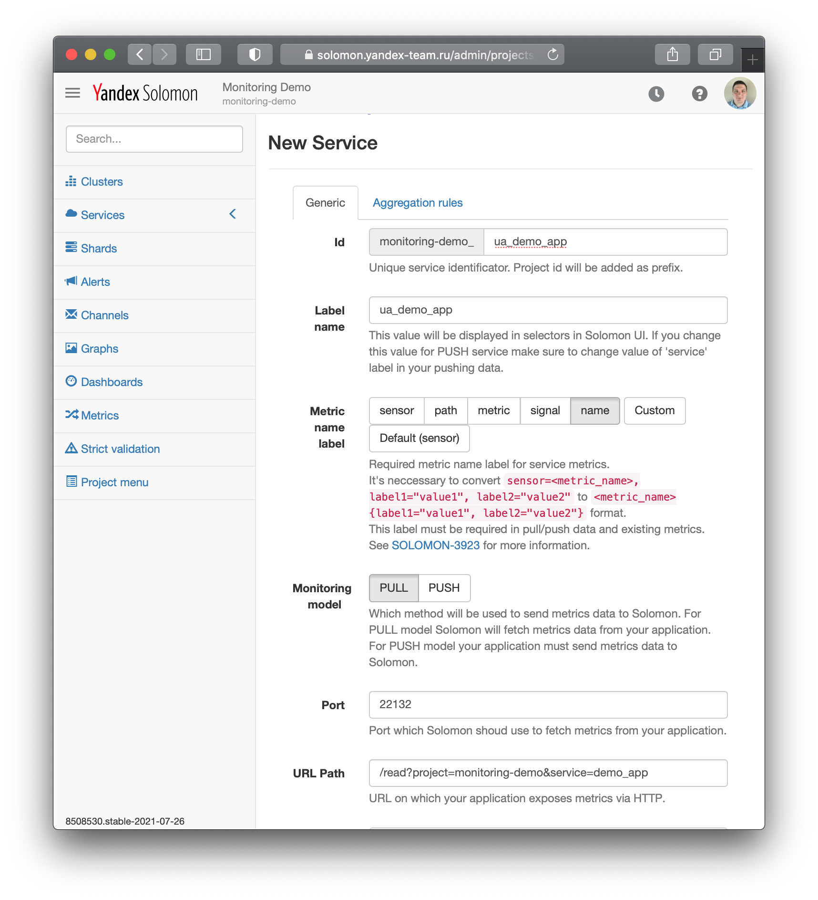

## Создание демонстрационного приложения

В качестве демонстрационного приложения будет использоваться пример, расположенный в Аркадии по адресу [library/python/monlib/examples/pull](https://a.yandex-team.ru/arc/trunk/arcadia/library/python/monlib/examples/pull).



Если у вас ещё нет копии Аркадии, её можно подготовить при помощи [инструкции](https://docs.yandex-team.ru/devtools/intro/quick-start-guide) в документации по инструментам разработки.



Код демонстрационного приложения можно посмотреть [здесь](https://a.yandex-team.ru/arcadia/library/python/monlib/examples/pull/__main__.py).

Соберите и запустите демонстрационное приложение:
```bash
$ cd $ARCADIA_ROOT/library/python/monlib/examples/pull
$ $ARCADIA_ROOT/ya make --checkout
$ PORT=3451 ./monlib-example
 * Serving Flask app "__main__" (lazy loading)
 * Environment: production
   WARNING: This is a development server. Do not use it in a production deployment.
   Use a production WSGI server instead.
 * Debug mode: off
 * Running on http://[::]:3451/ (Press CTRL+C to quit)
```

Убедитесь, что приложение корректно возвращает метрики:
```bash
$ curl localhost:3451
{"sensors":[{"kind":"HIST_RATE","labels":{"path":"ping","name":"responseTimeMillis"},"hist":{"bounds":[10,20,50,200,500],"buckets":[0,0,0,0,0],"inf":0}},{"kind":"RATE","labels":{"path":"ping","name":"requestRate"},"value":0},{"kind":"GAUGE","labels":{"name":"serverUptimeSeconds"},"value":72316.69974},{"kind":"RATE","labels":{"path":"metrics","name":"http.ok"},"value":1},{"kind":"RATE","labels":{"path":"","name":"http.client_error"},"value":2}]}
```

Примеры на других языках: [С++](https://a.yandex-team.ru/arc/trunk/arcadia/library/cpp/monlib/example/monlib_example.cpp), [Java](https://a.yandex-team.ru/arc/trunk/arcadia/library/java/monlib/metrics-examples), [Go](https://a.yandex-team.ru/arc/trunk/arcadia/library/go/core/metrics/solomon).

## Настройка сбора метрик {#data-collection}

Сбор данных в Solomon конфигурируется при помощи трёх сущностей:
- сервис: определяет режим поставки метрик и описывает приложение, с которого осуществляется сбор метрик;
- кластер: для pull-режима сбора метрик определяет набор хостов, с которых необходимо собирать метрики;
- шард: связка сервиса и кластера, физически хранит в себе метрики, имеет различные [лимиты](../../monitoring/concepts/limits.md) на количество метрик.

Также в кластере и шарде можно переопределить некоторые параметры, заданные в сервисе. Порядок приоритетов следующий: Шард **>** Кластер **>** Сервис. Настройки, заданные в шарде, имеют наивысший приоритет.

### Создание сервиса {#service}

Для создания сервиса, кластера и шарда необходимо открыть ваш проект в Solomon UI.

Создайте сервис:
1. Перейдите в раздел _Services_;
1. Откройте форму создания сервиса при помощи кнопки _New service_;
1. Введите следующие параметры кластера:
   - _Id_: `<YOUR_PROJECT_ID>_demo_app` ;
   - _Label_: `demo_app`;
   - _Metric name label_: name;
   - _Monitoring model_: PULL;
   - _Port_: `3451`;
   - _URL Path_: `/read?project=<YOUR_PROJECT_ID>&service=<YOUR_PROJECT_ID>_demo_app` (подставьте свой идентификатор проекта вместо <YOUR_PROJECT_ID>);
1. Подтвердите создание сервиса нажатием кнопки _Create_.


<small>Рисунок 2 — Заполненная форма создания сервиса.</small>

### Создание кластера {#cluster}

Создайте кластер:
1. Перейдите в раздел _Clusters_;
1. Откройте форму создания кластера при помощи кнопки _Create new_;
1. Введите следующие параметры кластера:
   - _Id_: `<YOUR_PROJECT_ID>_demo_host` ;
   - _Label_: `demo_host`;
1. Поле _Port_ указывать не следует, его значение будет унаследовано из определения сервиса;

Добавьте хосты, на которых будет запущено тестовое приложение, в кластер:

