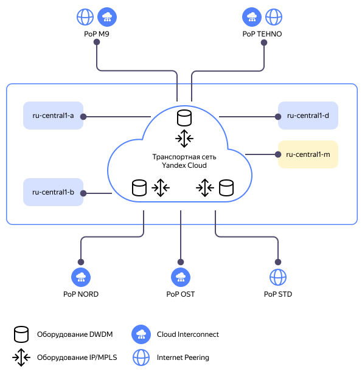

# Устройство сети в {{ yandex-cloud }}

Сеть в {{ yandex-cloud }} можно условно разделить на две большие части: 

* [Физическая сеть](#underlay) — это аппаратная сеть внутри [центров обработки данных (ЦОД)](../../overview/concepts/geo-scope.md), транспортная сеть между ЦОД и в [местах подключения](../../interconnect/concepts/pops.md) к внешним сетям и интернету. Физическую сеть часто называют термином *Underlay*.
* [Виртуальная сеть](#overlay) — работает поверх физической сетевой инфраструктуры. Сервисы виртуальной сети [Virtual Private Cloud (VPC)](../../vpc/concepts/) предоставляют пользователю:
  * IP-связность между облачными ресурсами.
  * Доступ облачных ресурсов к интернету.

  Виртуальную сеть часто называют термином *Overlay*. В одном [каталоге ресурсов](../../resource-manager/concepts/resources-hierarchy.md#folder) может быть создана одна или несколько [виртуальных сетей](../../vpc/concepts/network.md). Виртуальные сети изолированы друг от друга, даже если они находятся в одном каталоге ресурсов.

Ниже приведено краткое описание устройства [физической сети](#underlay) и [виртуальной сети](#overlay) в {{ yandex-cloud }}. Больше информации об устройстве сети можно найти в разделе [дополнительные материалы](#refs).

## Физическая сеть в {{ yandex-cloud }} {#underlay}

Физическую сеть в {{ yandex-cloud }} можно представить следующим образом:

Один из основных компонентов физической сети — *транспортная сеть {{ yandex-cloud }}*. 

К транспортной сети подключаются: 

* [ЦОД (зоны доступности)](../../overview/concepts/geo-scope.md) {{ yandex-cloud }}.
* [Точки присутствия](../../interconnect/concepts/pops.md) (Point of Presence или PoP). На точках присутствия размещается сетевое оборудование транспортной сети. На отдельных точках присутствия организуются подключения к внешним сетям и интернету (*Internet Peering*). На отдельных точках присутствия клиентам {{ yandex-cloud }} предоставляется возможность организовать IP-связность между своими ресурсами в собственной инфраструктуре и [облачными ресурсами](../../interconnect/concepts/priv-con.md) и [публичным сервисам](../../interconnect/concepts/pub-con.md#svc-list) {{ yandex-cloud }} с помощью услуги [{{ interconnect-full-name }}](../../interconnect/concepts/).

Транспортная сеть {{ yandex-cloud }} состоит из двух уровней:

* Уровень оптической сети DWDM. Оборудование оптического спектрального уплотнения ([DWDM](https://en.wikipedia.org/wiki/Wavelength-division_multiplexing#DWDM_systems)) обеспечивает подключение оборудования уровня пакетной сети IP/MPLS. С помощью DWDM-оборудования транспортная сеть может легко наращивать свою емкость (полосу пропускания) до десятков терабит.
* Уровень пакетной сети IP/MPLS. Обеспечивает IPv4-связность между зонами доступности и точками присутствия (Underlay и Overlay), а также обеспечивает сетевой транспорт для работы всех сервисов {{ yandex-cloud }}.

Зоны доступности связаны между собой через транспортную сеть {{ yandex-cloud }}. К узлам транспортной сети подключаются и точки присутствия, на которых организуется сетевое взаимодействие с другими сетями, в том числе с интернетом. Транспортная сеть обеспечивает отказоустойчивую передачу трафика между зонами доступности и точками присутствия. 

Трафик во внешний мир от облачных ресурсов во всех зонах доступности примерно равномерно распределяется по всем точкам присутствия. 

Трафик из внешнего мира к облачным ресурсам примерно равномерно распределяется по всем зонам доступности {{ yandex-cloud }}. 

Все зоны доступности равнозначны — они обеспечивают одинаковую сетевую связность, то есть, одну и ту же скорость и пропускную способность. Задержки при передаче трафика от одного внешнего ресурса до облачных ресурсов в разных зонах доступности могут незначительно отличаться.

## Виртуальная сеть в {{ yandex-cloud }} {#overlay}

Виртуальная сеть в {{ yandex-cloud }} состоит из набора сетевых функций сервиса [{{ vpc-name }}](../../vpc/concepts/) и предоставляет пользователям следующие возможности:

* Организация сетевого взаимодействия между облачными ресурсами.
* Организация сетевого взаимодействия между облачными ресурсами и интернетом. 
* Дополнительные сетевые функции по обработке трафика ([CloudGate](#cloudgate)).

Виртуальная сеть в {{ yandex-cloud }} построена на основе избранных компонентов проекта OpenContrail, который потом был переименован в [Tungsten Fabric](https://github.com/tungstenfabric/opencontrails-docs).

Виртуальную сеть в {{ yandex-cloud }} можно представить следующим образом:

В архитектуре виртуальной сети {{ yandex-cloud }} можно выделить следующие основные компоненты:

### VRouter {#vrouter}

*VRouter* — обработчик сетевого трафика. Работает на каждом физическом сервере {{ yandex-cloud }}. Выступает для всех объектов в подсети в виде шлюза по умолчанию (первый IP-адрес в подсети (`x.x.x.1`)). Обеспечивает обработку сетевого трафика всех виртуальных машин, работающих на сервере. Передача трафика (forwarding) осуществляется в соответствии с таблицей коммутации (flows table), записи в которой программируются с помощью другого компонента виртуальной сети — VRouter-agent. Для передачи трафика через [Underlay](#underlay) используется технология туннелирования трафика [MPLS over UDP](https://datatracker.ietf.org/doc/html/rfc7510).

VRouter обеспечивает работу функции One-to-one NAT для [публичных IP-адресов](../../vpc/concepts/address.md#public-addresses) ВМ.

VRouter обеспечивает работу [групп безопасности (SG)](../../vpc/concepts/security-groups.md) для всех виртуальных машин физического сервера, на котором он запущен.

### VRouter-agent {#vrouter-agent}

VRouter-agent — вспомогательный компонент для обработки трафика. Работает совместно с VRouter и программирует таблицу коммутации сетевых потоков (flows) на сервере. Таблица коммутации определяет правила передачи трафика для того или иного IP-префикса. VRouter-agent обеспечивает ВМ на сервере работу следующих протоколов и функций:

* [Сервис метаданных ВМ](../../compute/concepts/vm-metadata.md), доступный только внутри ВМ по IP-адресу `169.254.169.254`.
* Cлужба DNS. Обрабатывает трафик DNS на втором IP-адресе в облачной подсети (`x.x.x.2`).
* Протокол ICMP.

### CloudGate {#cloudgate}

CloudGate — группы сервисных ВМ в каждой [зоне доступности](../../overview/concepts/geo-scope.md), которые обеспечивают IP-взаимодействие между физической и виртуальной сетями, а также предоставляют дополнительные сетевые функции:

* [NAT-шлюз (NAT-GW)](../../vpc/concepts/gateways.md).
* [Сетевой балансировщик нагрузки (NLB)](../../network-load-balancer/concepts/).
* [Cloud Interconnect (CIC)](../../interconnect/concepts/).

Каждая сетевая функция в составе компонента CloudGate работает на отдельной группе сервисных виртуальных машин внутри {{ yandex-cloud }}.



Группы сервисных виртуальных машин для всех сетевых функций CloudGate развернуты в каждой [зоне доступности](../../overview/concepts/geo-scope.md). На схеме выше для упрощения понимания представлено расположение элементов CloudGate в рамках одной зоны доступности. 



## Виды сетевого взаимодействия {#flows}

ЦОД напрямую соотносятся с [зонами доступности](../../overview/concepts/geo-scope.md) {{ yandex-cloud }}.

На схеме выше показаны основные виды сетевого взаимодействия ВМ в виртуальной сети {{ yandex-cloud }}:

#### Трафик между ВМ в одной зоне доступности {#between-vm-in-one-az}

Трафик от ВМ `VM-A1` до ВМ `VM-A2` в зоне доступности A будет передаваться по пути:

1. `VM-A1` → `VRouter на Server-A1`.
1. `Server-A1` → `Server-A2` (внутри зоны доступности A).
1. `VRouter на Server-A2` → `VM-A2`.

#### Трафик между ВМ в разных зонах доступности {#between-vm-in-different-az}

Трафик от ВМ `VM-A2` в зоне доступности А до ВМ `VM-B1` в зоне доступности B будет передаваться по пути:

1. `VM-A2` → `VRouter на Server-A2`.
1. `Server-A2` → Граничное сетевое оборудование транспортной сети зоны доступности А.
1. Граничное сетевое оборудование транспортной сети зоны доступности А → граничное сетевое оборудование транспортной сети зоны доступности B.
1. Граничное сетевое оборудование зоны доступности B → `Server-B1`.
1. `VRouter на Server-B1` → `VM-B1`.

#### Трафик от ВМ в интернет через NAT-шлюз {#from-vm-to-internet-via-nat-gateway}

Трафик от ВМ `VM-A1` в Интернет через NAT-шлюз будет передаваться по пути:

1. `VM-A1` → `VRouter на Server-A1`.
1. `Server-A1` → функция `NAT-GW` компонента CloudGate (по внутренней сети зоны доступности A).
1. `NAT-GW` → граничное сетевое оборудование зоны доступности A.
1. Граничное сетевое оборудование в зоне доступности A → сетевое оборудования на точке присутствия, где организовано подключение к внешним сетям и интернету.

## Ограничения {#limits}

1. Сейчас для организации сетевой связности в виртуальной сети {{ yandex-cloud }} можно использовать только протокол IPv4. Протокол IPv6 не поддерживается.
1. Виртуальная сеть в {{ yandex-cloud }} работает на третьем уровне модели OSI (L3), поэтому работа сетевых технологий второго уровня модели OSI (L2) сильно ограничена:
    1. Ответы на ARP-запросы от VRouter (шлюза по умолчанию) всегда будут приходить от одного и того же фиксированного MAC-адреса.
    1. Для сетевого взаимодействия используется только `Unicast` транспорт, `Multicast` транспорт не поддерживается.
    1. Сетевые протоколы, которые требуют использования одного виртуального IP-адреса (VIP) между ВМ, такие как, HSRP, VRRP, GLBP и подобные не поддерживаются.

## Дополнительные материалы {#refs}

* [Как устроена сетевая инфраструктура в Yandex Cloud (2019)](https://habr.com/ru/companies/yandex/articles/437816/).
* [Как устроен сервис Virtual Private Cloud в Yandex Cloud (2020)](https://habr.com/ru/companies/yandex/articles/487694/).

