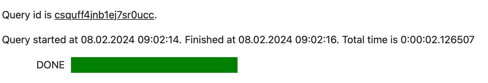

## Шаблонизация запросов с помощью mustache-синтаксиса {#templating}

Шаблоны вычислений между {{ jlab }} и {{ yq-name }} можно использовать для работы с запросами, а также для выполнения типовых операций без написания кода на языках программирования. Для этого в {{ yq-name }} встроена поддержка написания запросов в [mustache-синтаксисе](https://mustache.github.io), когда все ключевые слова и директивы шаблонов размещаются внутри ключевых символов `{{}}`. Mustache-синтаксис можно использовать с [Jinja2](https://jinja.palletsprojects.com/en/3.1.x/) или во встроенном интерпретаторе Mustache-синтаксиса.

Встроенные mustache-шаблоны {{ `yq-name` }} позволяют передавать переменные из среды исполнения {{ jlab }} прямо внутрь SQL-запросов. При этом передаваемые переменные автоматически будут конвертированы в нужные структуры данных {{ yq-name }}. Например:

```python
myQuery = "select * from Departments"
%yq not_var{{myQuery}}
```

Mustache-строка `not_var{{myQuery}}` будет интерпретирована как название переменной, откуда нужно взять текст. При этом в {{ yq-name }} будет отправлен для исполнения текст `select * from Departments`.

Использование mustache-шаблонов упрощает интеграцию между {{ jlab }} и {{ yq-name }}. Например, у вас есть Python list `lst=["Academy", "Physics"]`, содержащий названия департаментов, данные из которых вы хотите обработать. Без поддержки mustache-синтаксиса в {{ yq-name }} вам предварительно нужно было бы превратить Python list в строку и передать ее в SQL запрос. Пример запроса:

```python
var lstStr = ",".join(lst)
sqlQuery = f'select "Academy" in ListCreate({lstStr});
%yq not_var{{sqlQuery}}
```

То есть для работы со сложными типами данных нужно знать детали синтаксиса SQL {{ yq-name }}. При использовании mustache-синтаксиса запрос можно написать проще:

```sql
%yq select "Academy" in not_var{{lst}}
```

При этом `lst` будет распознан как Python list и будет автоматически вставлена правильная SQL-конструкция для работы со списками. В данном случае в результате всех преобразований в {{ yq-name }} будет отправлен следующий текст запроса:

```sql
%yq select "Academy" in ListCreate("Academy", "Physics") as lst
```

### Jinja2 {#jinja2}

При типовой работе в {{ jlab }} и {{ yq-name }} рекомендуется использовать встроенный mustache-синтаксис. Если вам нужны расширенные возможности шаблонизации, используйте шаблоны Jinja2.

Чтобы установить Jinja2, выполните команду:

```python
%pip install Jinja2
```

Пример использования Jinja-шаблона с циклом `for`:

```python

    command = "select * from users where name='not_var{{ user }}'"

```

Также c помощью Jinja-шаблонов можно выполнять различные операции обработки данных. В следующем примере, в зависимости от департамента, где обучается студент, выполняются различные операции над названием департамента:

```python

    not_var{{ student.department|upper }}

    not_var{{ student.department|capitalize }}

```

Чтобы указать Jinja, что конвертация должна выполняться по правилам {{ yq-name }}, используйте специальный фильтр `to_yq`. Например, Python list `lst=["Academy", "Physics"]` из предыдущего примера в Jinja-шаблоне будет иметь вид:

```sql
%%yq --jinja2
select "Academy" in not_var{{lst|to_yq}}
```

В случаях, когда нужно отключить шаблонизацию, используйте аргумент `--no-var-expansion`:

```sql
%%yq --no-var-expansion
...
```

### Встроенные mustache-шаблоны {#embedded_mustache}

Встроенные mustache-шаблоны в {{ yq-full-name }} включены по умолчанию и с их помощью удобно выполнять базовые операции работы с переменными {{ jlab }}:

```python
lst=["Academy", "Physics"]
```

```sql
%yq select "Academy" in not_var{{lst}}
```

#### Использование переменных Pandas DataFrame {#capture-dataframe}

Пример использования пакета `yandex_query_magic` и mustache-синтаксиса с [Pandas DataFrame](https://pandas.pydata.org/docs/reference/api/pandas.DataFrame.html):

1. Объявите переменную в {{ jlab }}:

    ```python
    df = pandas.DataFrame({'_float': [1.0],
                        '_int': [1],
                        '_datetime': [pd.Timestamp('20180310')],
                        '_string': ['foo']})
    ```

`df` может использоваться как переменная в запросах к {{ yq-full-name }}. Во время выполнения запроса значение из переменной `df` используется для создания временной таблицы с тем же названием, `df`. Временная таблица может использоваться в пределах текущего исполняемого запроса в {{ yq-full-name }}.

1. Получите данные:

    ```sql
    %%yq
    SELECT
        *
    FROM mytable
    INNER JOIN not_var{{df}}
        ON mytable.id=df._int
    ```

Таблица соответствия типов Pandas и типов {{ yq-name }}:

| Тип Pandas | Тип YQL | Примечание |
|-----|-----|-----|
| int64 | Int64 | При выходе значения за диапазон `int64` возникнет ошибка выполнения SQL-запроса |
| float64 | Double ||
| datetime64[ns] | Timestamp | Точность до микросекунд. При задании наносекунд ([поле `nanosecond`](https://pandas.pydata.org/docs/user_guide/timeseries.html#time-date-components)) возвращается исключение |
| str | String ||

#### Использование переменных Python dict {#capture-dict}

Пример использования `yandex_query_magic` и mustache-синтаксиса с Python dict:

1. Объявите переменную в {{ jlab }}:

    ```python
    dct = {"a": "1", "b": "2", "c": "test", "d": "4"}
    ```

    Теперь переменная `dct` может использоваться напрямую в запросах {{ yq-name }}. Во время выполнения запроса `dct` будет преобразован в соответствующий объект [YQL Dict](https://ydb.tech/docs/ru/yql/reference/builtins/dict):

    | Ключ | Значение |
    |---|---|
    | а | "1" |
    | b | "2" |
    | c | "test" |
    | d | "4" |

1. Получите данные:

    ```sql
    %%yq
    SELECT "a" in not_var{{dct}}
    ```

Таблица соответствия типов Python dict и типов {{ yq-name }}:

| Тип Python | Тип YQL | Примечание |
|-----|-----|-----|
| int | Int64 | При выходе значения за диапазон int64 возникнет ошибка выполнения SQL-запроса |
| float | Double ||
| datetime | Timestamp ||
| str | String ||

Словарь также можно преобразовать в таблицу [Pandas DataFrame](#capture-dataframe) с помощью конструктора:

```python
df = pandas.DataFrame(dct)
```

#### Использование переменных Python list {#capture-list}

Пример использования `yandex_query_magic` и mustache-синтаксиса с Python list:

1. Объявите переменную в {{ jlab }}:

    ```python
    lst = [1,2,3]
    ```

    Тогда переменная `lst` может использоваться напрямую в запросах {{ yq-name }}. Во время выполнения запроса `lst` будет преобразован в соответствующий объект [YQL List](https://ydb.tech/docs/ru/yql/reference/types/containers).

1. Получите данные:

    ```sql
    %%yq
    SELECT 1 IN not_var{{lst}}
    ```

Таблица соответствия типов Python list и типов {{ yq-name }}:

| Тип Python | Тип YQL | Примечание |
|-----|-----|-----|
| int | Int64 | При выходе значения за диапазон int64 возникнет ошибка выполнения SQL-запроса |
| float | Double ||
| datetime | Timestamp ||
| str | String ||

Список также можно преобразовать в таблицу [Pandas DataFrame](#capture-dataframe) с помощью конструктора:

```python
df = pandas.DataFrame(lst,
                      columns =['column1', 'column2', 'column3'])
```

### Шаблоны Jinja {#jinja}

Шаблоны Jinja удобно использовать для создания SQL-запросов. Они позволяют автоматически вставлять в них разные данные, например, условия поиска, без необходимости писать каждый запрос вручную. Это упрощает работу, избавляет от ошибок и делает код более понятным.

Используя шаблоны Jinja, можно также автоматизировать создание запросов с повторяющимися элементами, добавляя, например, список значений для проверки в запросе, с помощью циклов в самом шаблоне. Это делает процесс ещё более гибким и экономит время на написание сложных запросов, когда нужно работать с множеством данных.

Ниже показано как отфильтровать данные в {{ yq-full-name }}, используя переменную Python.

1. Объявите переменную в {{ jlab }}:

    ```python
    name = "Ivan"
    ```

1. Выполняя следующий код в ячейке {{ jlab }}, обратите внимание, что для интерпретации SQL-запросов как [Jinja2-шаблонов](https://jinja.palletsprojects.com/en/) перед исполнением необходимо указать флаг `jinja2`:

    ```sql
    %%yq <другие_параметры> --jinja2

    SELECT "not_var{{name}}"
    ```

    Параметры:

    * `--jinja2`– включает рендеринг текста запроса с использованием шаблонов [Jinja](https://jinja.palletsprojects.com/). Для использования требуется установленный пакет [Jinja2](https://pypi.org/project/Jinja2/) (`%pip install Jinja2`).

#### Фильтр `to_yq` {#to_yq}

Шаблонизатор Jinja2 является системой шаблонизации общего назначения. При работе со значениями переменных Jinja2 использует стандартное строковое представление типов данных.

Например, задан Python list `lst=["Academy", "Physics"]`, использовать его в Jinja-шаблоне можно так:

```sql
%%yq --jinja2
select "Academy" in not_var{{lst}}
```

В результате исполнения мы получим ошибку `Unexpected token '['`. Ошибка возникает из-за того, что шаблонизатор Jinja конвертирует переменную `lst` в строку `["Academy", "Physics"]` по правилам Python, без учета специфики SQL-запросов в {{ yq-full-name }}.

Для указания, что конвертация должна выполняться по правилам {{ yq-full-name }}, необходимо использовать фильтр `to_yq`. Тогда тот же запрос в Jinja-синтаксисе будет выглядеть так:

```sql
%%yq --jinja2
select "Academy" in not_var{{lst|to_yq}}
```

Jinja-фильтр `to_yq` выполняет преобразование данных в синтаксис {{ yq-full-name }} полностью аналогично [встроенным mustache-шаблонам](#embedded_mustache).

## Захват результатов выполнения команд {#capture-command-result}

Результат исполнения line magic command может быть захвачен с помощью команды присваивания:

```
varname = %yq <запрос>
```

Результат выполнения cell magic command можно захватить, указав имя переменной в начале текста запроса и оператор `<<`:

```
%%yq
varname << <запрос>
```

После этого результат выполнения можно использовать, как обычную переменную {{ jlab }}.

Например, захватим результат выполнения команды в переменные `output` с помощью cell magic:

```sql
output = %yq SELECT 1 as column1
```

А в данном примере захватим результат выполнения в переменную `output2` с помощью line magic:

```sql
%%yq
output2 << SELECT 'Two' as column2, 3 as column3
```

Далее эти переменные можно использовать, как обычные переменные IPython. Например, можно вывести их на печать:

```python
output
```

По умолчанию результатом выполнения команд `%yq` и `%%yq` является [Pandas DataFrame](https://pandas.pydata.org/docs/reference/api/pandas.DataFrame.html) с колонками, совпадающими с названиями колонок из SQL-запроса и со строками, содержащими результаты запроса. Конвертацию в `Pandas DataFrame` можно отключить с помощью [аргумента --raw-results](#usage).

В примере выше переменная `output` будет обладать следующей структурой:

||**column1**|
|---|----|
|**0**|1|

Переменная `output2` будет выглядить следующим образом:

||**column2**|**column3**|
|---|----|-----|
|**0**|Two|3|

Если запрос не предполагает возврат результатов (например, `insert into table select * from another_table`), то возвращаемым значением будет `None`. Если в результате выполнения запроса было возвращено несколько наборов результатов, то они будут представлены в виде списка (`list`) из отдельных результатов.

Во время выполнения запроса пакет `yandex_query_magic` выводит дополнительную информацию. Например: идентификатор запроса, время начала и продолжительность выполнения запроса:



Чтобы скрыть отображение прогресса выполнения для ячейки, можно использовать дополнительную команду `%%capture`.

```
%%capture
%%yq
<запрос>
```

В этом случае информация о ходе прогресса исполнения не будет выводиться в консоль.
