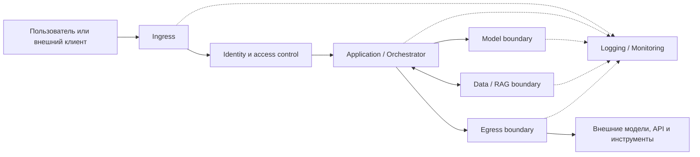

ИИ-приложение образует сквозной путь: вход пользователя или системы, прикладная логика, API, RAG-источники, агентные инструменты, внешние получатели и телеметрия. В `AI-SDLC1` фиксируется, где устанавливаются личность и полномочия субъекта, где данные становятся недоверенными, где модельный вывод превращается в действие и где запрос покидает границу контролируемой зоны.

Приложение должно быть разделено как минимум на следующие логические контуры:

| Контур | Назначение | Минимальный результат обеспечения безопасности |
|---|---|---|
| **Ingress** | Прием пользовательских и внешних запросов | Недоверенный ввод валидируется, ограничивается по размеру и частоте, а также отделяется от внутренних компонентов приложения |
| **Identity** | Аутентификация и авторизация пользователей, сервисов и агентов | Все субъекты имеют проверяемую идентичность; доступ предоставляется по принципу минимально необходимых привилегий |
| **Application** | Оркестрация бизнес-логики, сборка промпта, RAG-контекста и вызовов инструментов | Пользовательский ввод, системные инструкции, найденное содержимое и результаты инструментов обрабатываются как отдельные недоверенные источники |
| **Model** | Взаимодействие с LLM или иной AI-моделью | В модель передаются только минимально необходимые данные; секреты, учетные данные и неконтролируемые системные инструкции не включаются в промпт |
| **Data/RAG** | Загрузка, хранение, индексация и извлечение данных | RAG-контент имеет происхождение, классификацию и метаданные доступа; поиск возвращает только данные, разрешенные конкретному субъекту |
| **Egress** | Обращение к внешним LLM, API, плагинам и инструментам | Исходящие соединения разрешаются только к утвержденным получателям; передача данных контролируется, минимизируется и регистрируется |
| **Logging/Monitoring** | Аудит, обнаружение атак и расследование инцидентов | События позволяют восстановить цепочку запроса, решений приложения, обращений к данным, вызовов модели и инструментов без записи избыточных секретов или ПДн |

Приведенная схема является логической моделью для анализа, а не обязательной физической топологией: один компонент может реализовывать несколько контуров, а один контур — состоять из нескольких сервисов. Для каждого контура должны быть определены владелец, допустимые потоки данных, механизмы доступа, события аудита и процедуры реагирования. В архитектуре конкретной ИИ-системы может отсутствовать какая-либо ветвь (например, нет внешних вызовов или агентных инструментов).
