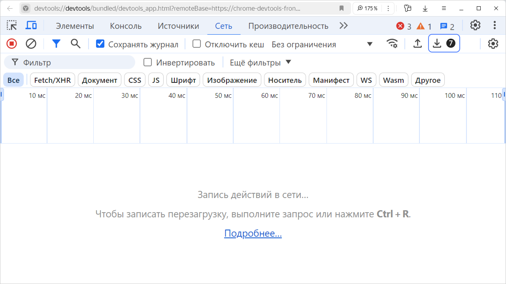

1. На странице с ошибкой нажмите сочетание клавиш **Ctrl** + **Shift** + **I** (**⌥** + **⌘** + **I** для macOS) или откройте меню  → **Дополнительно** (**Advanced**) → **Инструменты разработчика** (**Developer tools**).
1. Перейдите на вкладку **Сеть** (**Network**).
1. Убедитесь, что запись сетевого журнала включена: в левом верхнем углу кнопка красная . Если кнопка серая, нажмите ее.
1. Включите опцию **Сохранять журнал** (**Preserve log**).
1. Чтобы в HAR-файле оказались только записи, касающиеся ошибки, очистите журнал: нажмите  справа от кнопки записи сетевого журнала.
1. Обновите страницу или повторите действия, которые приводят к ошибке.
1. Нажмите  **Экспорт HAR (очищено)...** (**Export HAR (sanitized)...**) и сохраните HAR-файл.

    

1. Приложите HAR-файл к сообщению в [техническую поддержку]({{ link-console-support }}).
