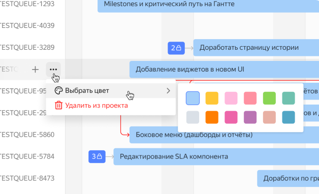

По умолчанию все полосы задач на диаграмме отображаются в голубом цвете. Чтобы настроить для задач разные цвета:

1. Над временной шкалой справа нажмите &nbsp;**Настройки диаграммы**.
1. В блоке **Цвет** вы можете назначение цвета вручную прямо на диаграмме или настроить цвета в зависимости от параметров задачи.

   

   - Назначать вручную

     1. Отметьте пункт **назначать вручную**.
     1. Нажмите **Применить**.
     1. Выберите задачу в списке слева от диаграммы и нажмите  **Меню действий задачи**.
     1. Выберите цвет.

     

   - По параметрам задачи

     1. Отметьте пункт **по параметрам задачи**. 
     1. Укажите параметр, значениям которого вы будете назначать цвет.
     1. Нажмите **Применить**.

   



Если вы оставили цвет по умолчанию, назначение цветов в  **Меню действий задачи** будет недоступно.


