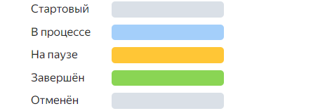

По умолчанию полосы задач на диаграмме раскрашены по цветам в зависимости от типа статуса задачи, который настраивается в [редакторе рабочих процессов](../../tracker/manager/workflow.md). 

Чтобы выбрать другую цветовую схему:

1. Над временной шкалой справа нажмите &nbsp;**Настройки диаграммы**.
1. В блоке **{{ ui-key.startrek-backend.fields.issue.paletteColor }}** вы можете выбрать подходящий вариант цветовой схемы:

   

   - Назначать вручную
     
     С помощью этой опции вы сможете назначать цвета для задач прямо на диаграмме.

     1. Выберите **назначать вручную**.
     1. Нажмите кнопку **Применить**.

     В списке слева от диаграммы выберите задачу и нажмите кнопку  **Меню действий задачи**. Откроется палитра, из которой вы сможете назначить задаче цвет.

     

   - По параметрам задачи

     Опция пригодится, если нужно различать задачи по некоторому параметру, например, очереди или тегу.

     1. Выберите **по параметрам задачи**. 
     1. Укажите параметр, значениям которого вы будете назначать цвет.
     1. Нажмите кнопку **Применить**.
  
   - Однотонный

     Полосы всех задач на диаграмме будут отображаться в голубом цвете.

     1. Выберите **однотонный**.
     1. Нажмите кнопку **Применить**.

   
