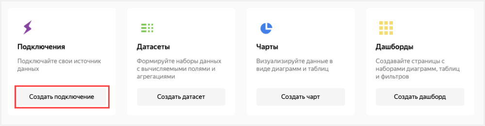

# Визуализация данных из AppMetrica

В качестве источника данных будет использовано приложение, которое добавлено в сервис [AppMetrica](https://appmetrica.yandex.ru). Просмотреть список доступных вам приложений можно в разделе [Приложения](https://appmetrica.yandex.ru/application/list).

Если у вас нет доступных приложений, то перед выполнением сценария вам необходимо [добавить приложение](https://appmetrica.yandex.ru/docs/quick-start/concepts/quick-start.html) или использовать стандартный **Дашборд AppMetrica**. 

Для визуализации и исследования данных [подготовьте облако к работе](#before-you-begin), затем выполните следующие шаги:

1. [Создайте подключение и стандартный дашборд](data-from-appmetrica-visualization.md#create-dashboard).
1. [Измените стандартный дашборд](data-from-appmetrica-visualization.md#edit-dashboard).

## Подготовьте облако к работе {#before-you-begin}



## Создайте подключение и стандартный дашборд {#create-dashboard}



Шаг доступен для пользователей, у которых есть приложение в сервисе AppMetrica. Если у вас нет приложений, откройте стандартный **Дашборд AppMetrica** и перейдите к [следующему шагу](data-from-appmetrica-visualization.md#edit-dashboard).



1. Перейдите в [{{ datalens-short-name }}](https://datalens.yandex.ru) и нажмите кнопку **Создать подключение**.

    

1. Выберите коннектор **AppMetrica**.

    

1. Введите имя подключения `My AppMetriсa` и нажмите кнопку **Получить токен**.

    

    Если вы впервые создаете подключение к приложению в AppMetrica, то предоставьте сервису необходимые разрешения.

1. Выберите необходимое приложение из выпадающего списка.

    
    
1. Задайте настройки подключения:

    

    1. Задайте точность данных (сэмплирование). Вы можете изменить точность после создания подключения.
    1. Выберите тип подключения **Прямой доступ**.
    1. Включите опцию **Автоматически создать дашборд на данном подключении**.

1. В правом верхнем углу нажмите кнопку **Создать**.

    После создания подключения откроется папка с дашбордом и набором датасетов и чартов.

## Измените стандартный дашборд {#edit-dashboard}



Если у вас нет приложения в AppMetrica и вы пропустили предыдущий шаг, используйте **Дашборд AppMetrica**.



Вы можете изменять стандартный [дашборд](../../datalens/concepts/dashboard.md) так, как вам удобно. Например, вы можете удалить чарт, изменить его размер, сменить тип визуализации.

1. Откройте дашборд.

1. Нажмите кнопку **Редактировать** в правом верхнем углу.

    

1. Чтобы удалить виджет **Динамика клик**, нажмите значок  в правом верхнем углу.

    

1. Чтобы изменить размер виджета **Динамика установки**, потяните его за правый нижний угол.

1. Нажмите кнопку **Сохранить** в правом верхнем углу и сохраните дашборд.

     

Вы можете отредактировать любой чарт на дашборде. Например, измените тип визуализации для чарта **Рекламные сети** из раздела **Привлечение пользователей**. 
