# Веб-аналитика с подключением к Яндекс.Метрике через Logs API

Технология **Logs API** позволяет получать неагрегированные данные Яндекс.Метрики, обрабатывать их и использовать для решения аналитических задач.



Для прохождения данного сценария вам необходимо иметь доступ к счетчику Яндекс.Метрики и базу данных {{ CH }} в {{ yandex-cloud }}.



Доступные счетчики смотрите в [личном кабинете](https://metrika.yandex.ru/list) Метрики.

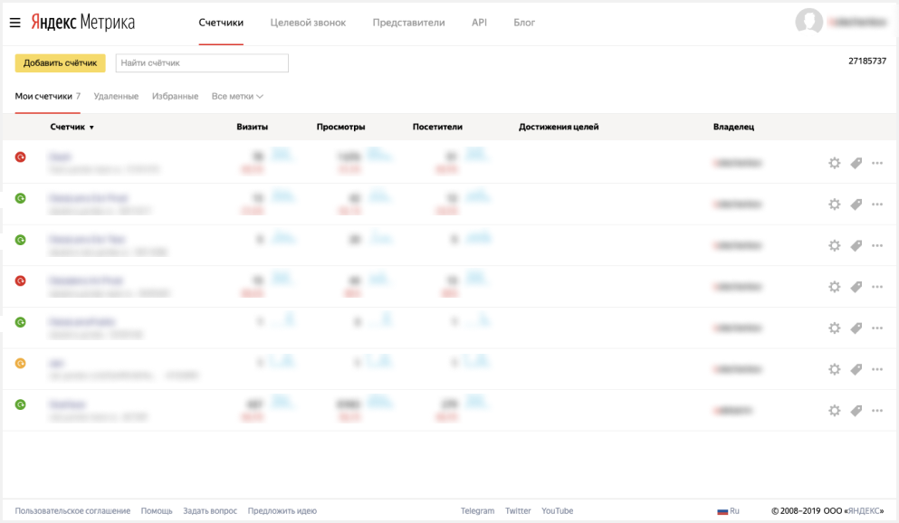

О том, как создать {{ CH }}-кластер, читайте в [документации {{ mch-name }}](../../managed-clickhouse/operations/cluster-create.md).
 
Для визуализации и исследования данных [подготовьте облако к работе](#before-you-begin), затем выполните следующие шаги:

1. [Создайте подключение и стандартный дашборд](#step1).
1. [Измените стандартный дашборд](#step2).
1. [Измените чарт](#step3).

## Подготовьте облако к работе {#before-you-begin}



## Шаг 1. Создайте подключение и стандартный дашборд {#step1}

1. Перейдите на [главную страницу]({{ link-datalens-main }}) {{ datalens-short-name }}.
1. Нажмите кнопку **Создать подключение**.

    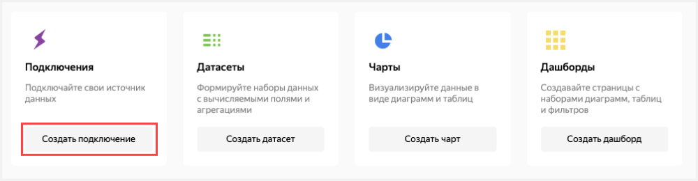

1. Выберите **Metriсa**.

    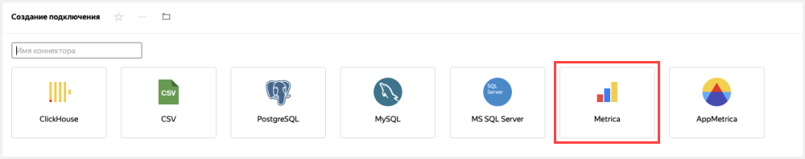

1. Введите имя подключения `My Metriсa Logs API`.
1. Нажмите кнопку **Получить токен**.

    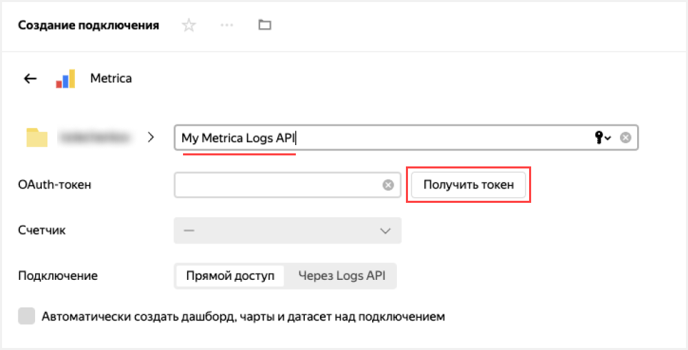

1. В открывшемся окне предоставьте сервису необходимые разрешения.
1. Из выпадающего списка под надписью **Счетчик** выберите необходимый счетчик. 

    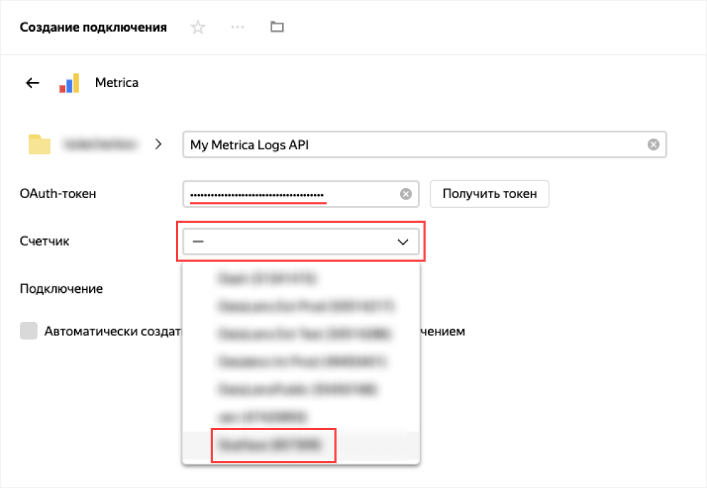

1. Выберите тип подключения **Через Logs API**.

    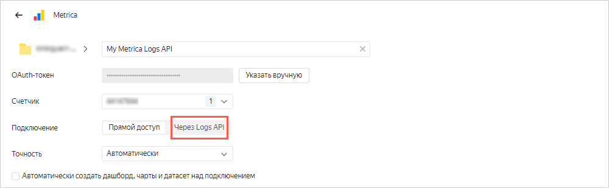

1. Заполните параметры загрузки и реквизиты доступа к целевой базе данных.
    1. Включите опцию **Автоматически создать дашборд, чарты и датасет над подключением**.
    1. В поле **Источник счетчика** выберите **Визиты**.
    1. В поле **Загружать с** выберите дату, начиная с которой будут выгружаться данные. Например, `09.07.2021`.
    1. Выберите опцию **Регулярная**. Данные будут обновляться автоматически каждый день.
    1. В поле **Имя хоста** укажите хост базы данных {{ CH }}. Реквизиты доступа к базе данных можно получить на странице подключения к кластеру {{ CH }} в [консоли]({{ link-console-main }}).
    
        
    
        Подключение Metrica Logs API работает только с базами данных {{ CH }}, развернутыми в {{ yandex-cloud }}.
    
        
    
    1. В поле **Порт** укажите порт базы данных, по умолчанию `8443`.
    1. Укажите **Имя базы данных**, **Имя пользователя** и **Пароль**.
    1. Нажмите **Проверить подключение**, чтобы проверить правильность реквизитов прав доступа к БД. Зеленая галочка рядом с кнопкой указывает на успешное подключение.

    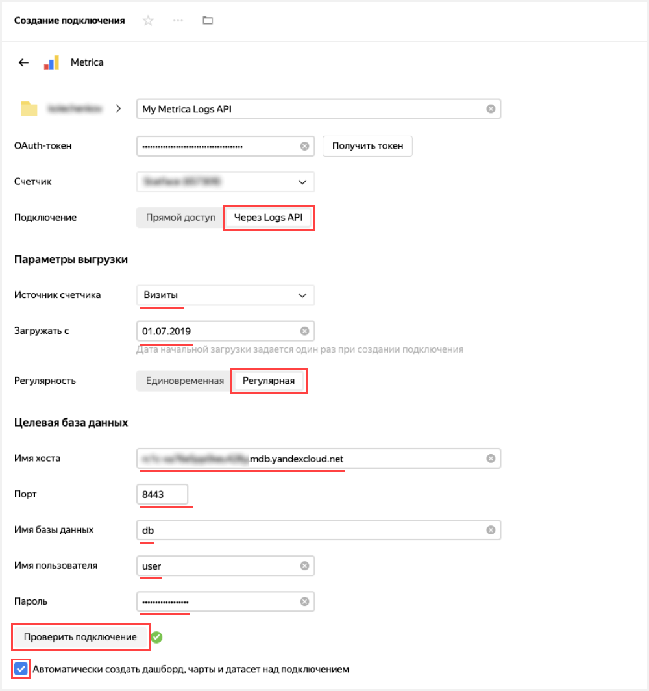

1. Нажмите кнопку **Создать**.

    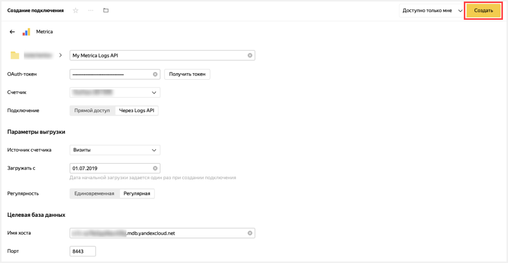

     

     На загрузку данных счетчика из Яндекс.Метрики в базу данных {{ CH }} может уйти от нескольких минут до десятков часов в зависимости от объема данных и даты начала загрузки. 

     

1. После создания подключения откроется папка с набором датасетов, чартов и дашборда. Перейдите на дашборд **Дашборд по данным Метрики**.

    

  Если при открытии дашборда вы увидете ошибки на графиках, значит данные еще не прогрузились. Вернитесь к продолжению сценария через полчаса.

## Шаг 2. Измените стандартный дашборд {#step2}

Вы можете изменять стандартный [дашборд](../../datalens/concepts/dashboard.md) так, как вам удобно. Например, вы можете удалить ненужный чарт.

1. Откройте дашборд над данными вашего счетчика. Попробуйте различные способы фильтрации чартов.

1. В правом верхнем углу нажмите кнопку **Редактировать**.

    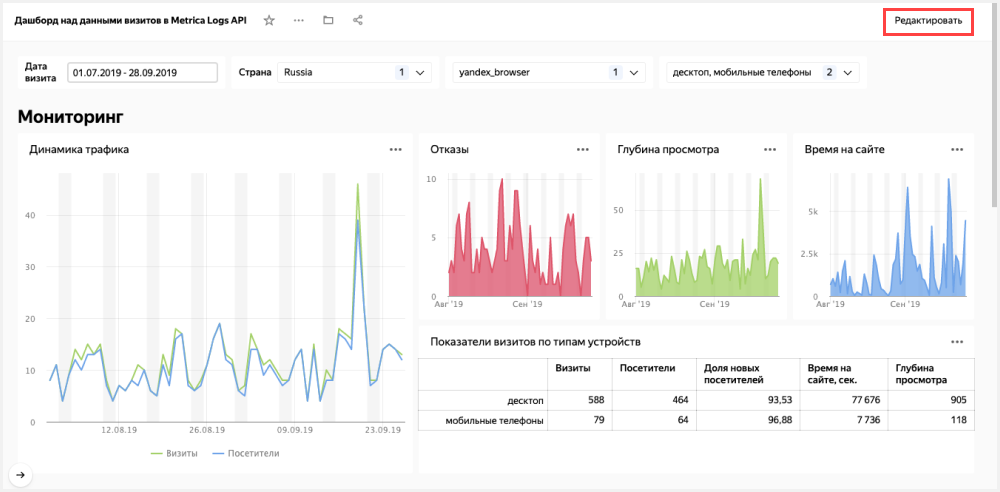

1. Удалите чарт **Глубина просмотров**. Для этого в правом верхнем углу чарта нажмите значок  и выберите **Удалить**.

    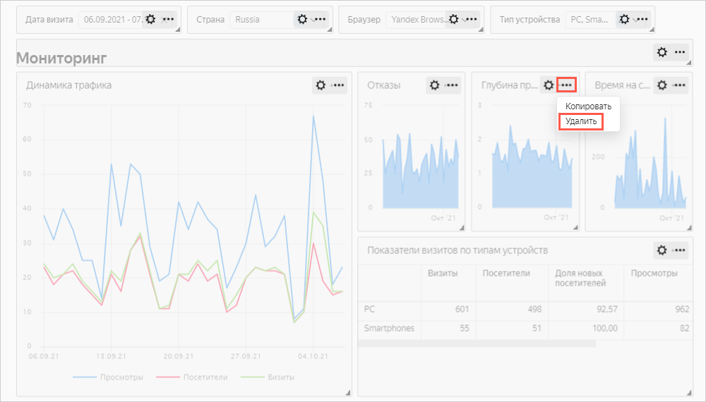
    
1. Разместите чарты **Отказы** и **Время на сайте** таким образом, чтобы они заполнили пустое пространство после удаления чарта на предыдущем шаге. Перетаскивать чарты можно нажав на сам чарт, растягивать и ужимать — через треугольник в нижнем правом углу чарта.

    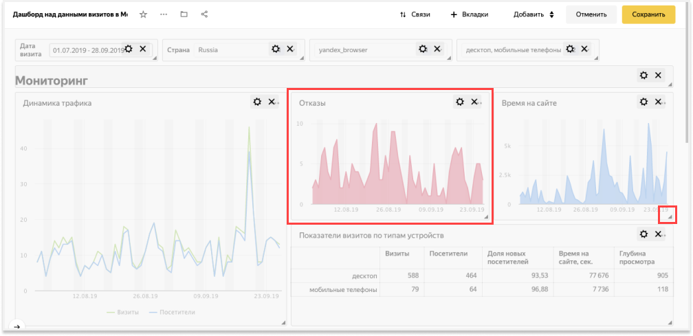
 
1. В правом верхнем углу нажмите кнопку **Сохранить**.

     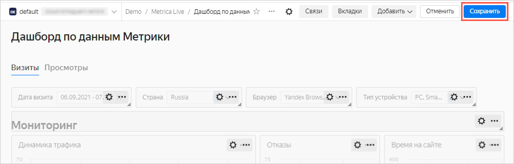

## Шаг 3. Измените чарт {#step3}

Вы можете отредактировать любой чарт на дашборде. Например, изменить тип визуализации для диаграммы **Визиты по типам устройств и ОС** из раздела **Технологии**.

1. В правом верхнем углу чарта **Визиты по типам устройств и ОС** нажмите значок  и выберите **Редактировать**.

    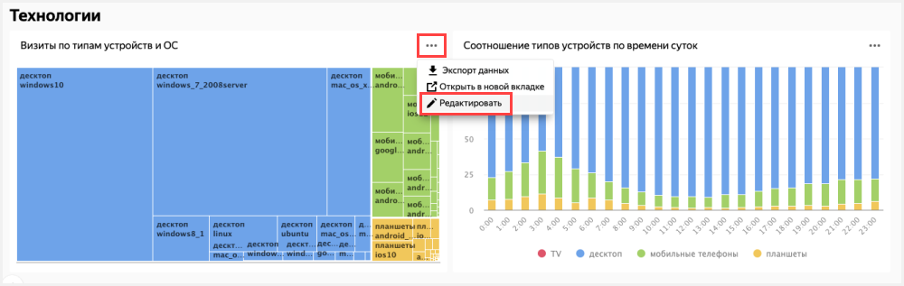

1. Выберите другой тип чарта — **Круговая диаграмма**.

    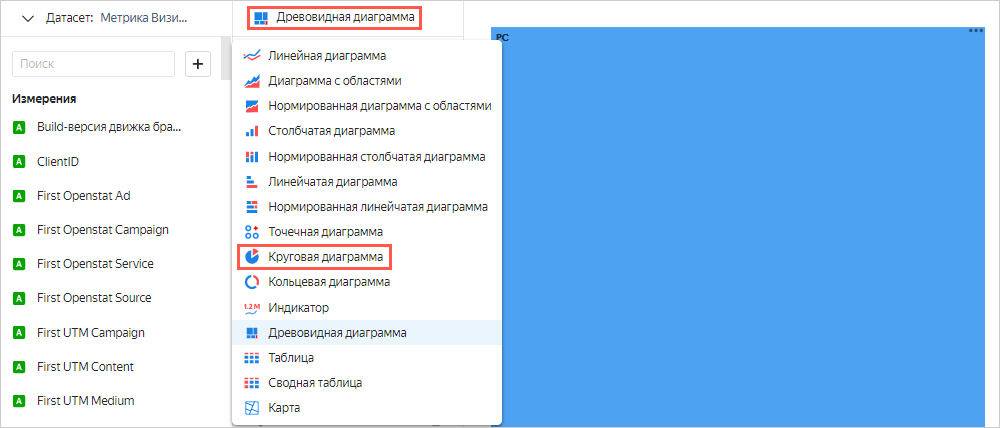

1. В правом верхнем углу нажмите кнопку **Сохранить**.

    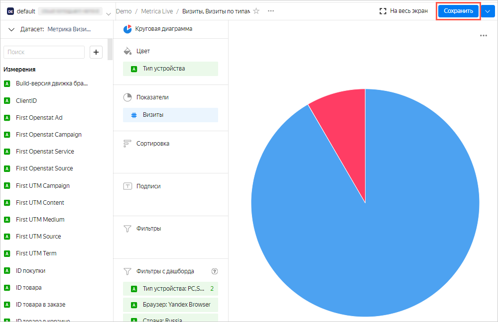

1. Закройте вкладку с редактированием чарта и вернитесь в окно с дашбордом.
1. Обновите дашборд, и убедитесь, что в разделе **Технологии** чарт изменился.

    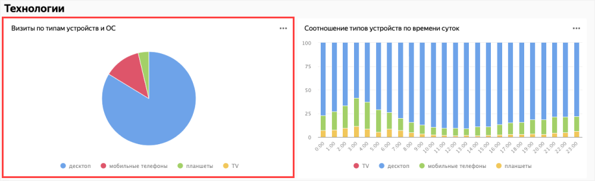
