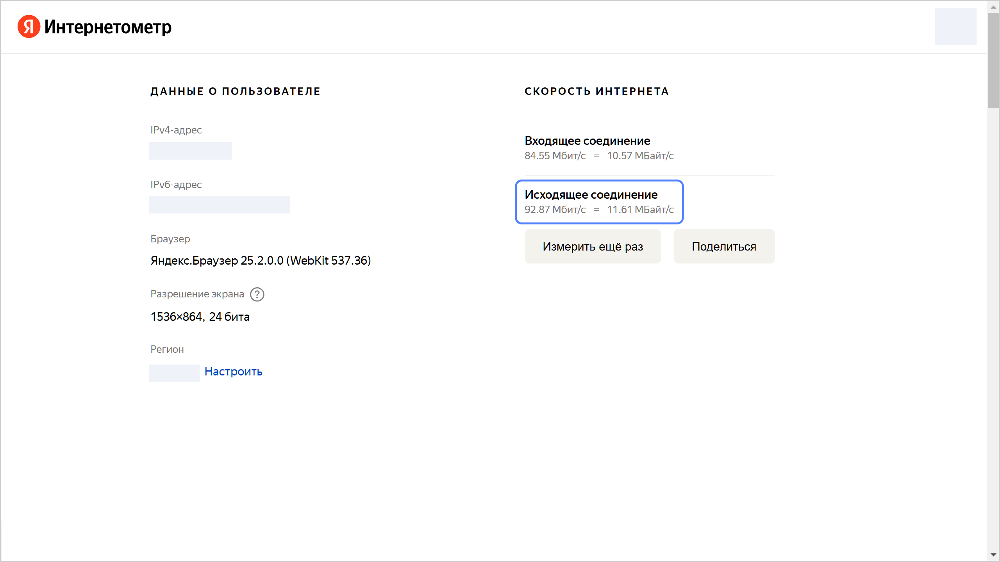

Узнать скорость интернета можно с помощью [Яндекс.Интернетометра](https://yandex.ru/internet). Он показывает скорость исходящего соединения интернета в Мбит/с и в МБайт/с. Битрейт в OBS Studio измеряется в Kbps или Кбит/с, 1 Мбит/с = 1024 Kbps. Оптимальный битрейт видео для прямой трансляции в формате [Full HD](https://ru.wikipedia.org/wiki/Full_HD) (1080p) со скоростью 30 кадров в секунду составляет 4000 Kbps. Битрейт трансляции не должен превышать значения `Исходящее соединение`.

Например:

Здесь скорость исходящего соединения — 92.87 Мбит/с или 95 098 Kbps. Поэтому вы можете установить в OBS Studio рекомендуемое значение битрейта в 4000 Kbps. Слишком высокий битрейт создает чрезмерно большие файлы, которые сложно использовать в потоковой передаче, особенно при медленном интернете. Рекомендуем иметь в запасе примерно в 1,5 раза большую скорость исходящего соединения, чем ваш битрейт, чтобы избежать возможных потерь качества трансляции.

Подробнее об измерении скорости интернета с помощью Яндекс.Интернетометра см. в разделе [Измерить скорость интернета](https://yandex.ru/support2/internet/ru/measure).
