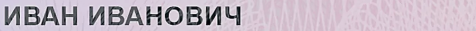

На изображении должна быть только одна строка текста, а высота текста должна быть не меньше 80% от высоты изображения, иначе результаты распознавания с моделью `line` будут непредсказуемы. Пример правильного изображения:

