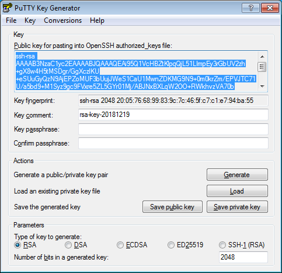

Чтобы подключаться к виртуальной машине по [SSH](../glossary/ssh-keygen.md)SSH, нужна пара ключей: открытый ключ размещается на виртуальной машине, а закрытый ключ хранится у пользователя. Такой способ более безопасен, чем подключение по логину и паролю.



Роутер Cisco Cloud Services Router (CSR) 1000v поддерживает только ключи, сгенерированные по алгоритму RSA.

Чтобы создать пару ключей:



- Linux/macOS
  
  1. Откройте терминал.
  1. Создайте новый ключ с помощью команды `ssh-keygen`:

     ```
     ssh-keygen -t rsa -b 2048
     ```

     После выполнения команды вам будет предложено указать имена файлов, в которые будут сохранены ключи, и ввести пароль для закрытого ключа. По умолчанию используется имя `id_rsa`, ключи создаются в директории `~/.ssh`.

     Публичная часть ключа будет сохранена в файле `<имя_ключа>.pub`.
  
- Windows 10

  1. Запустите `cmd.exe` или `powershell.exe`.
  1. Создайте новый ключ с помощью команды `ssh-keygen`:

     ```
     ssh-keygen -t rsa -b 2048
     ```

     После выполнения команды вам будет предложено указать имена файлов, в которые будут сохранены ключи, и ввести пароль для закрытого ключа. По умолчанию используется имя `id_rsa`. Ключи создаются в директории `C:\Users\<имя_пользователя>\.ssh\` или `C:\Users\<имя_пользователя>\` в зависимости от интерфейса командной строки.

     Публичная часть ключа будет сохранена в файле с названием `<имя_ключа>.pub`. 
      
  
- Windows 7/8
  
  Создание ключей для Windows будет выполняться с помощью приложения PuTTY.
  
  1. [Скачайте](https://www.putty.org) и установите PuTTY.
  1. Убедитесь, что директория, куда вы установили PuTTY, присутствует в `PATH`:
     1. Нажмите правой кнопкой на **Мой компьютер**. Выберите пункт **Свойства**.
     1. В открывшемся окне выберите **Дополнительные параметры системы**, затем **Переменные среды** (находится в нижней части окна).
     1. В разделе **Системные переменные** найдите `PATH` и нажмите **Изменить**.
     1. В поле **Значение переменной** допишите путь к директории, куда вы установили PuTTY.
  1. Запустите приложение PuTTYgen.
  1. В качестве типа генерируемой пары выберите **RSA** и укажите длину 2048. Нажмите **Generate** и поводите курсором в поле выше до тех пор, пока не закончится создание ключа.
  
     
  
  1. В поле **Key passphrase** введите надежный пароль. Повторно введите его в поле ниже.
  1. Нажмите кнопку **Save private key** и сохраните закрытый ключ. Никогда его никому не передавайте и не говорите никому ключевую фразу от него.
  1. Сохраните ключ в текстовом файле. Для этого скопируйте открытый ключ из текстового поля в текстовый файл с названием `id_rsa.pub`. Обратите внимание, что ключ должен быть записан **одной строкой** (не должно быть переносов и разрывов строки).
  

