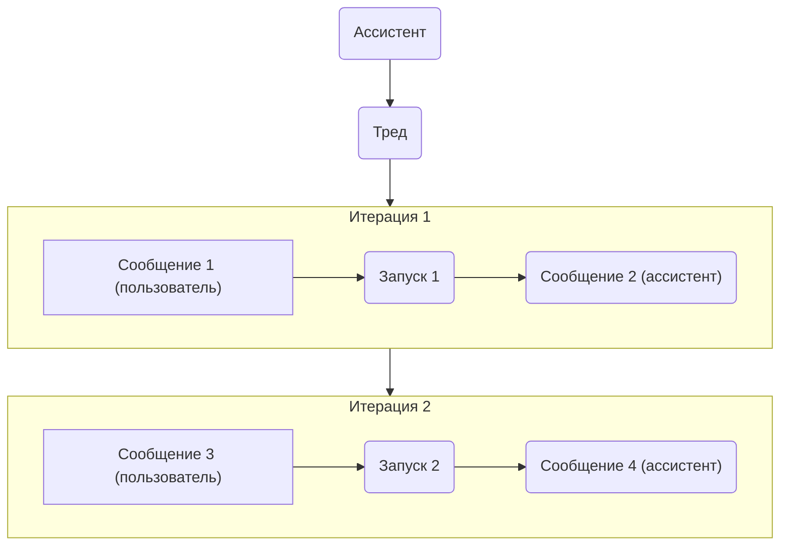

```mermaid
flowchart TB
 subgraph I1["Итерация 1"]
    direction LR
        U1["Сообщение 1 (пользователь)"] -->
        R1("Запуск 1") -->
        A1("Сообщение 2 (ассистент)")        
  end
 subgraph I2["Итерация 2"]
    direction LR
        U2["Сообщение 3 (пользователь)"] -->
        R2("Запуск 2") -->
        A2("Сообщение 4 (ассистент)")  
  end
    A("Ассистент") --> T("Тред")
    T --> I1
    I1 --> I2
```