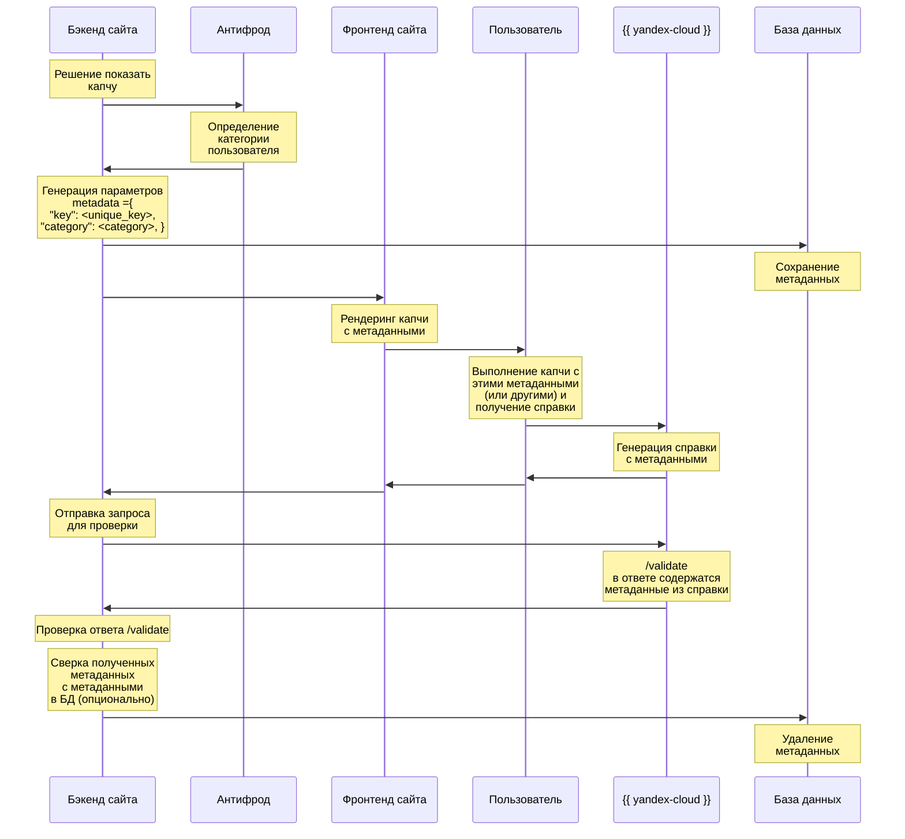

```mermaid
sequenceDiagram
    %% Участники процесса
    participant Backend as Бэкенд сайта
    participant Antifraud as Антифрод
    participant Frontend as Фронтенд сайта
    participant User as Пользователь
    participant CaptchaBackend as {{ yandex-cloud }}
    participant DB as База данных

    %% Ход выполнения
    Note over Backend: Решение показать<br/>капчу
    Backend->>Antifraud:  
    Note over Antifraud: Определение<br/>категории<br/>пользователя
    Antifraud->>Backend:  

    Note over Backend: Генерация параметров<br/>metadata ={<br/>"key": <unique_key>,<br/>"category": <category>, }
    
    Backend->>DB:  
    Note over DB: Сохранение<br/>метаданных

    Backend->>Frontend:  
    Note over Frontend: Рендеринг капчи<br/>с метаданными
    
    Frontend->>User:  
    
    Note over User: Выполнение капчи с<br/>этими метаданными<br/>(или другими) и <br/>получение справки
    User->>CaptchaBackend:  
    
    Note over CaptchaBackend: Генерация справки<br/> с метаданными
    CaptchaBackend->>User:  

    User->>Frontend:  
    Frontend->>Backend:  
    
    Note over Backend: Отправка запроса<br/>для проверки

    Backend->>CaptchaBackend:  
    Note over CaptchaBackend: /validate<br/>в ответе содержатся<br/> метаданные из справки
    CaptchaBackend->>Backend:  

    Note over Backend: Проверка ответа /validate

    Note over Backend: Сверка полученных<br/>метаданных<br/>с метаданными<br/>в БД (опционально)
    
    Backend->>DB:  
    Note over DB: Удаление<br/>метаданных
```