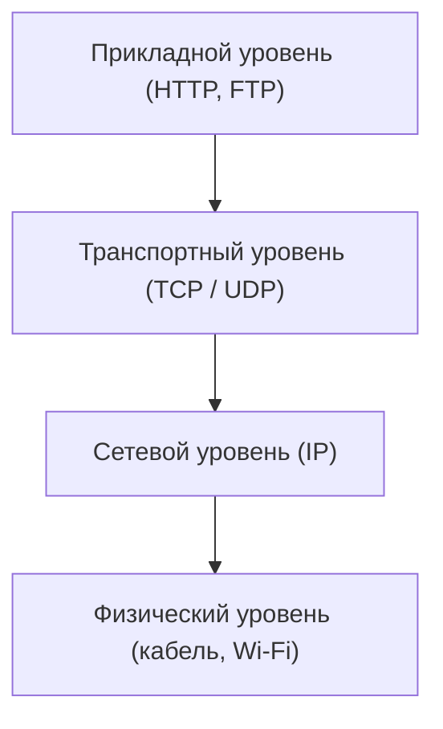

```mermaid
  flowchart TD
    A["Прикладной уровень (HTTP, FTP)"]
    B["Транспортный уровень (TCP / UDP)"]
    C["Сетевой уровень (IP)"]
    D["Физический уровень (кабель, Wi-Fi)"]

    A --> B
    B --> C
    C --> D
```