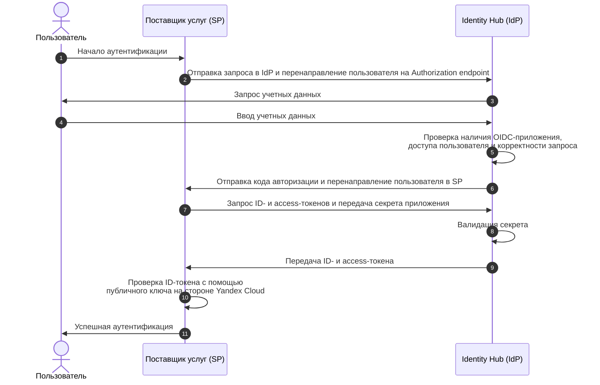

```mermaid
sequenceDiagram
  autonumber
  actor U as Пользователь
  
  participant SP as Поставщик услуг (SP)
  participant IdP as Identity Hub (IdP)

  U ->> SP: Начало аутентификации
  SP ->> IdP: Отправка запроса в IdP и перенаправление пользователя на Authorization endpoint
  IdP ->> U: Запрос учетных данных
  U ->> IdP: Ввод учетных данных
  IdP ->> IdP: Проверка наличия OIDC-приложения,<br/>доступа пользователя и корректности запроса
  IdP ->> SP: Отправка кода авторизации и перенаправление пользователя в SP
  SP ->> IdP: Запрос ID- и access-токенов и передача секрета приложения
  IdP ->> IdP: Валидация секрета 
  IdP ->> SP: Передача ID- и access-токена
  SP ->> SP: Проверка ID-токена с помощью<br/>публичного ключа на стороне Yandex Cloud 
  SP ->> U: Успешная аутентификация
```