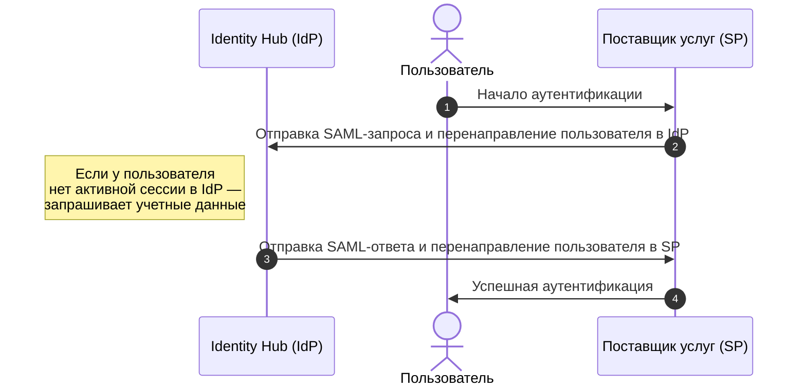

```mermaid
sequenceDiagram
    autonumber
    participant IdP as Identity Hub (IdP)
    actor U as Пользователь
    participant SP as Поставщик услуг (SP)

    U ->> SP: Начало аутентификации
    SP ->> IdP: Отправка SAML-запроса и перенаправление пользователя в IdP
    Note left of IdP: Если у пользователя<br/>нет активной сессии в IdP —<br/>запрашивает учетные данные
    IdP ->> SP: Отправка SAML-ответа и перенаправление пользователя в SP
    SP ->> U: Успешная аутентификация
```