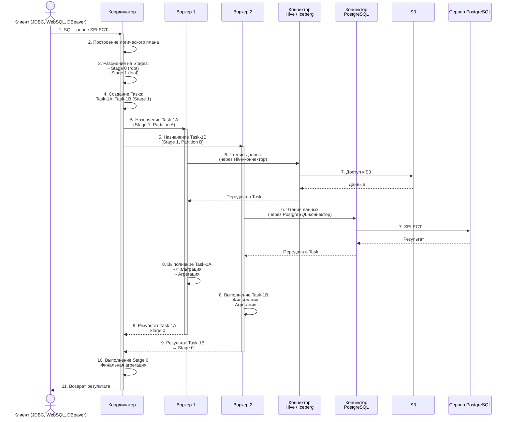

```mermaid
sequenceDiagram
  actor Client as Клиент (JDBC, WebSQL, DBeaver)
  participant Coordinator as Координатор
  participant Worker1 as Воркер 1
  participant Worker2 as Воркер 2
  participant Connector-hive as Коннектор<br/>Hive / Iceberg
  participant Connector-pg as Коннектор<br/>PostgreSQL
  participant Storage as S3
  participant Pg-server as Сервер PostgreSQL

  Client ->> Coordinator: 1. SQL-запрос SELECT ...
  activate Coordinator

  Coordinator ->> Coordinator: 2. Построение логического плана
  Coordinator ->> Coordinator: 3. Разбиение на Stages:<br/>- Stage 0 (root)<br/>- Stage 1 (leaf)
  Coordinator ->> Coordinator: 4. Создание Tasks:<br/>Task-1A, Task-1B (Stage 1)

  Coordinator ->> Worker1: 5. Назначение Task-1A<br/>(Stage 1, Partition A)
  activate Worker1
  Coordinator ->> Worker2: 5. Назначение Task-1B<br/>(Stage 1, Partition B)
  activate Worker2

  Worker1 ->> Connector-hive: 6. Чтение данных<br/>(через Hive-коннектор)
  Connector-hive ->> Storage: 7. Доступ к S3
  Storage -->> Connector-hive: Данные
  Connector-hive -->> Worker1: Передача в Task

  Worker2 ->> Connector-pg: 6. Чтение данных<br/>(через PostgreSQL-коннектор)
  Connector-pg ->> Pg-server: 7. SELECT ...
  Pg-server -->> Connector-pg: Результат
  Connector-pg -->> Worker2: Передача в Task

  Worker1 ->> Worker1: 8. Выполнение Task-1A:<br/>- Фильтрация<br/>- Агрегация
  Worker2 ->> Worker2: 8. Выполнение Task-1B:<br/>- Фильтрация<br/>- Агрегация

  Worker1 -->> Coordinator: 9. Результат Task-1A<br/>→ Stage 0
  deactivate Worker1
  Worker2 -->> Coordinator: 9. Результат Task-1B<br/>→ Stage 0
  deactivate Worker2

  Coordinator ->> Coordinator: 10. Выполнение Stage 0:<br/>Финальная агрегация

  Coordinator -->> Client: 11. Возврат результата
  deactivate Coordinator
```
