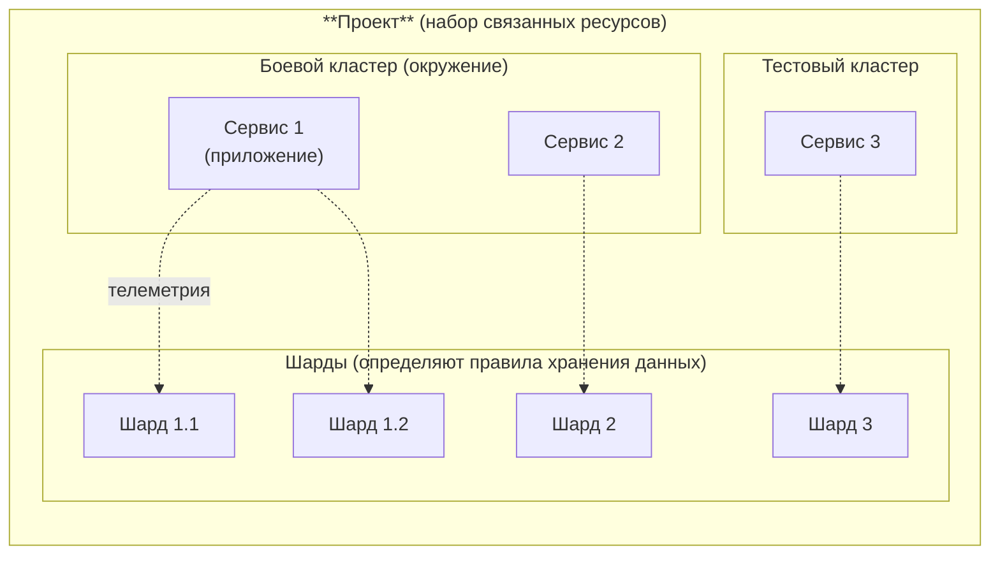

```mermaid
flowchart TB
  subgraph P["**Проект** (набор связанных ресурсов)"]
    direction TB

    subgraph C1["Боевой кластер (окружение)"]
      direction TB
        direction LR
        S1["Сервис 1<br>(приложение)"]
        S2["Сервис 2"]
    end

    subgraph C2["Тестовый кластер"]
      direction TB
        direction LR
        S3["Сервис 3"]
    end

    subgraph SH["Шарды (определяют правила хранения данных)"]
      direction LR
      SH1[Шард 1.1]
      SH2[Шард 1.2]
      SH3[Шард 2]
      SH4[Шард 3]
    end

    S1 -.->|телеметрия| SH1
    S1 -.->| | SH2
    S2 -.->| | SH3
    S3 -.->| | SH4
  end
```