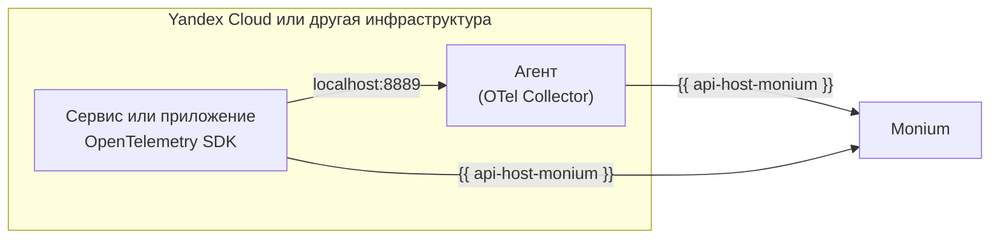

```mermaid
graph LR

  subgraph Local["Yandex Cloud или другая инфраструктура"]
    direction TB
    A["Сервис или приложение<br/>OpenTelemetry SDK"]
    B["Агент<br>(OTel Collector)"]
  end

  A -->|"localhost:8889"| B
  B -->|"{{ api-host-monium }}"| C
  A -->|"{{ api-host-monium }}"| C["Monium"]
```