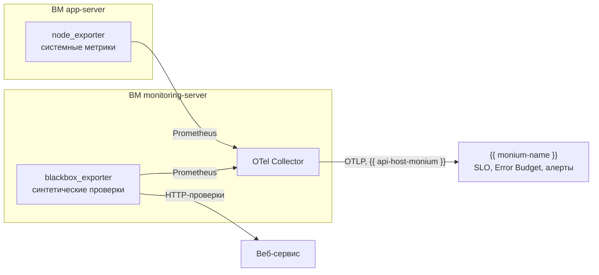

```mermaid
flowchart LR
    subgraph APP["ВМ app-server"]
      NE["node_exporter<br/>системные метрики"]
    end

    subgraph MON["ВМ monitoring-server"]
      SP1[" "]
      BB["blackbox_exporter<br/>синтетические проверки"]
      OTEL["OTel Collector"]
    end

    WEB["Веб-сервис"]

    NE -->|"Prometheus"| OTEL
    BB -->|"Prometheus"| OTEL
    BB -->|"HTTP-проверки"| WEB
    OTEL -->|"OTLP, {{ api-host-monium }}"| MONIUM["{{ monium-name }}<br/>SLO, Error Budget, алерты"]

    style SP1 fill:none,stroke:none
```