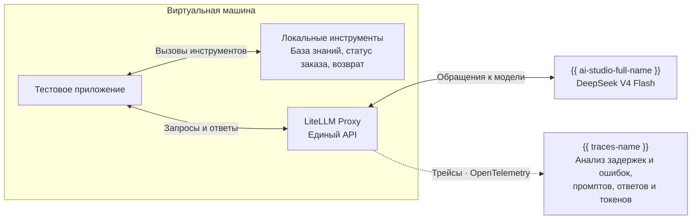

```mermaid
flowchart LR
    subgraph VM["Виртуальная машина"]
        APP["Тестовое приложение"]
        TOOLS["Локальные инструменты<br/>База знаний, статус заказа, возврат"]
        PROXY["LiteLLM Proxy<br/>Единый API"]

        APP <-->|"Вызовы инструментов"| TOOLS
        APP <-->|"Запросы и ответы"| PROXY
    end

    MODEL["{{ ai-studio-full-name }}<br/>DeepSeek V4 Flash"]
    TRACES["{{ traces-name }}<br/>Анализ задержек и ошибок,<br/>промптов, ответов и токенов"]

    PROXY <-->|"Обращения к модели"| MODEL
    PROXY -.->|"Трейсы · OpenTelemetry"| TRACES
```
