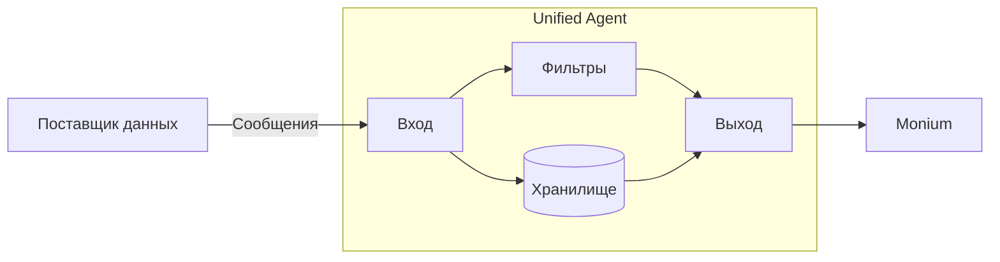

```mermaid
flowchart LR
    S[Поставщик данных] -->|Сообщения| IN[Вход]

    subgraph UA[Unified Agent]
      IN --> F[Фильтры]
      IN --> ST[(Хранилище)]
      F --> OUT[Выход]
      ST --> OUT
    end

    OUT --> MON[Monium]
```