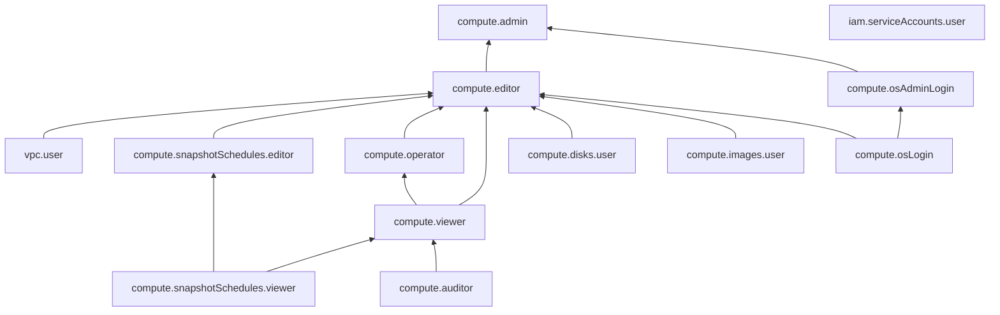

```mermaid
flowchart BT
    compute.osAdminLogin~~~iam.serviceAccounts.user
    vpc.user --> compute.editor
    compute.snapshotSchedules.viewer --> compute.viewer
    compute.snapshotSchedules.viewer --> compute.snapshotSchedules.editor
    compute.auditor --> compute.viewer
    compute.viewer --> compute.operator
    compute.snapshotSchedules.editor --> compute.editor
    compute.operator --> compute.editor
	 compute.viewer --> compute.editor
    compute.disks.user --> compute.editor
    compute.images.user --> compute.editor
    compute.osLogin --> compute.editor
    compute.osLogin --> compute.osAdminLogin
    compute.editor --> compute.admin
    compute.osAdminLogin --> compute.admin
```