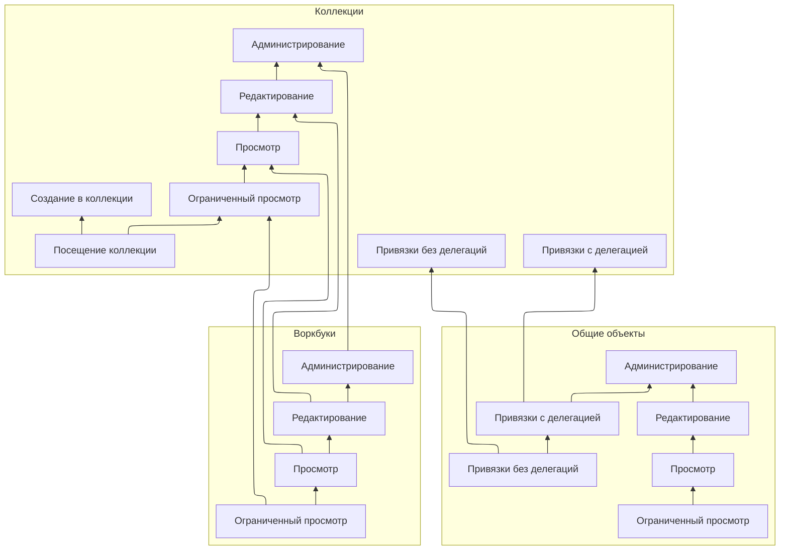

```mermaid
%%{init: {"flowchart": {'defaultRenderer': 'elk'}} }%%
flowchart BT

    subgraph sharedEntries["Общие объекты"]
    dl-se-limitedViewer["Ограниченный просмотр"] --> dl-se-viewer["Просмотр"] --> dl-se-editor["Редактирование"]
    dl-se-editor --> dl-se-admin["Администрирование"]

    dl-se-limitedEntryBindingCreator["Привязки без делегаций"] --> dl-se-entryBindingCreator["Привязки с делегацией"] --> dl-se-admin
    
    end;

    subgraph collections["Коллекции"]

        dl-coll-visitor["Посещение коллекции"] --> dl-coll-creator["Создание в коллекции"]

    dl-coll-visitor --> dl-coll-limitedViewer["Ограниченный просмотр"] --> dl-coll-viewer["Просмотр"] --> dl-coll-editor["Редактирование"] --> dl-coll-admin["Администрирование"]

    dl-coll-limitedEntryBindingCreator["Привязки без делегаций"]
    dl-coll-entryBindingCreator["Привязки с делегацией"]

    end;

    subgraph workbooks["Воркбуки"]
    dl-wb-limitedViewer["Ограниченный просмотр"] --> dl-wb-viewer["Просмотр"] --> dl-wb-editor["Редактирование"] --> dl-wb-admin["Администрирование"]
    end;

    dl-wb-limitedViewer --> dl-coll-limitedViewer
    dl-wb-viewer --> dl-coll-viewer
    dl-wb-editor --> dl-coll-editor
    dl-wb-admin --> dl-coll-admin

    dl-se-entryBindingCreator --> dl-coll-entryBindingCreator["Привязки с делегацией"]

    dl-se-limitedEntryBindingCreator --> dl-coll-limitedEntryBindingCreator

```
