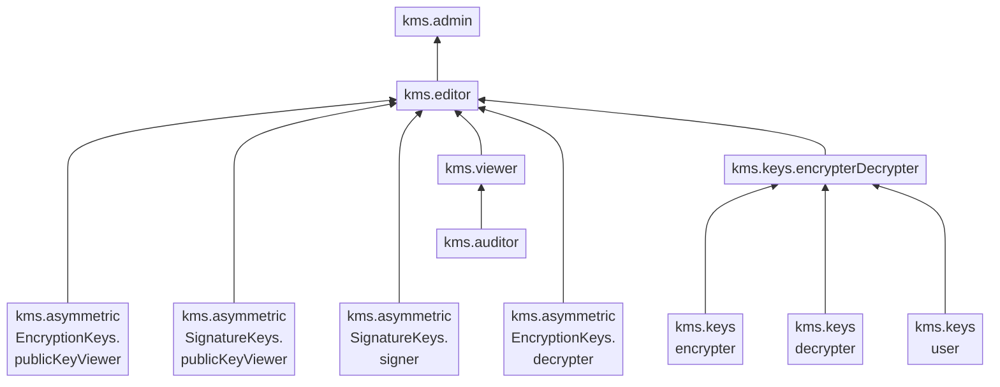

```mermaid
%%{init: { "flowchart": { "padding": 4 } } }%%
flowchart BT
    kms.editor --> kms.admin
    kms.asymmetricEncryptionKeys.publicKeyViewer["`kms.asymmetric
    EncryptionKeys.
    publicKeyViewer`"]
    kms.asymmetricEncryptionKeys.publicKeyViewer ----> kms.editor
    kms.asymmetricSignatureKeys.publicKeyViewer["`kms.asymmetric
    SignatureKeys.
    publicKeyViewer`"]
    kms.asymmetricSignatureKeys.publicKeyViewer ----> kms.editor
    kms.asymmetricSignatureKeys.signer["`kms.asymmetric
    SignatureKeys.
    signer`"]    
    kms.asymmetricSignatureKeys.signer ----> kms.editor
    kms.viewer --> kms.editor
    kms.auditor --> kms.viewer
    kms.asymmetricEncryptionKeys.decrypter["`kms.asymmetric
    EncryptionKeys.
    decrypter`"] 
    kms.asymmetricEncryptionKeys.decrypter ----> kms.editor
    kms.keys.encrypterDecrypter --> kms.editor
    kms.keys.encrypter["`kms.keys
    encrypter`"] ---> kms.keys.encrypterDecrypter
    kms.keys.decrypter["`kms.keys
    decrypter`"] ---> kms.keys.encrypterDecrypter
    kms.keys.user["`kms.keys
    user`"] ---> kms.keys.encrypterDecrypter
```